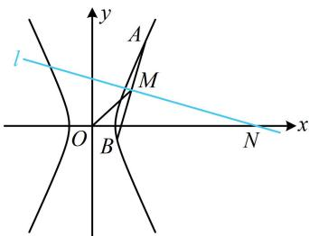

> [!faq]- 《第4节 高考中双曲线常用的二级结论》参考答案
>
> > [!success]- **【答案】** 2
>
> > [!note]- **【分析】**
> > 本题未单列分析。
>
> > [!note]- **【解析】**
> > 解析：如图，题干涉及双曲线的弦 $AB$ 的中点 $M$ ，想到中点弦斜率积结论，故先把直线 $AB$ 和 $OM$ 的斜率求出来，
> >
> > 设点 $M$ 的纵坐标为 $y_{M}$ ，则直线 $OM$ 的斜率 $k_{OM} = \frac{y_M}{x_M}$
> >
> > 再求 $k_{AB}$ ，题干只有 $M, N$ 的坐标关系，但注意到 $AB \perp MN$ ，故可先求 $k_{MN}$ ，再得到 $k_{AB}$ ，
> >
> > 因为 $MN \perp AB$ ，且 $k_{MN} = \frac{y_M}{x_M - x_N}$ ，所以 $k_{AB} = -\frac{1}{k_{MN}}$
> >
> > $= \frac{x_{N} - x_{M}}{y_{M}}$ ，故 $k_{AB}\cdot k_{OM} = \frac{x_N - x_M}{y_M}\cdot \frac{y_M}{x_M} = \frac{x_N - x_M}{x_M}$
> >
> > 结合 $x_{N}=4x_{M}$ 可得 $k_{AB}\cdot k_{OM}=3$
> >
> > 又由双曲线的中点弦斜率积结论， $k_{AB}\cdot k_{OM} = \frac{b^2}{a^2}$
> >
> > 所以 $\frac{b^2}{a^2} = 3$ ，从而 $3a^{2} = b^{2} = c^{2} - a^{2}$ ，故 $c^2 = 4a^2$
> >
> > 所以 C 的离心率 $e=\frac{c}{a}=2$ .
> >
> > 
