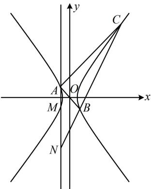

> [!faq]- 《第4节 高考中双曲线常用的二级结论》参考答案
>
> > [!success]- **【答案】** C
>
> > [!note]- **【分析】**
> > 本题未单列分析。
>
> > [!note]- **【解析】**
> > （2024·浙江绍兴模拟·★★★★）
> > 已知点 A, B, C 都在双曲线 $\Gamma: \frac{x^{2}}{a^{2}} - \frac{y^{2}}{b^{2}} = 1 (a > 0, b > 0)$ 上，且点 A, B 关于原点对称， $\angle CAB = 90^{\circ}$ ，过 A 作垂直于 x 轴的直线分别交 $\Gamma$ ，BC 于点 M, N。若 $\overrightarrow{AN} = 3\overrightarrow{AM}$ ，则 $\Gamma$ 的离心率是（）
> > A. $\sqrt{2}$ B. $\sqrt{3}$ C. 2 D. $2\sqrt{3}$
> >
> > 解析：如图，注意到 $A$ ， $B$ 是双曲线上关于原点对称的两点， $C$ 在双曲线上，联想到双曲线的第三定义斜率积结论，条件 $\angle CAB = 90^{\circ}$ 刚好也可以用斜率翻译．表示斜率需要有关点的坐标，故先设坐标，设谁的坐标呢？仔细观察会发现设 $A$ 的坐标最方便，因为根据对称性，可以获得 $B$ ， $M$ 的坐标，结合题设条件 $\overrightarrow{AN} = 3\overrightarrow{AM}$ 又能求出 $N$ 的坐标，设 $A(x_0,y_0)$ ，则由对称性可得 $B(-x_0, - y_0)$ ， $M(x_0, - y_0)$ ，由 $\overrightarrow{AN} = 3\overrightarrow{AM}$ 得 $(x_{N} - x_{0},y_{N} - y_{0}) = 3(0, - 2y_{0}) = (0, - 6y_{0})$ ，所以 $\left\{ \begin{array}{l}x_N - x_0 = 0\\ y_N - y_0 = -6y_0 \end{array} \right.$ ，故 $\left\{ \begin{array}{l}x_N = x_0\\ y_N = -5y_0 \end{array} \right.$ ，即 $N(x_0, - 5y_0)$ 由双曲线的第三定义斜率积结论， $k_{CA}\cdot k_{CB} = \frac{b^2}{a^2}$ ①，
> >
> > 没有 $C$ 的坐标，不方便直接求 $k_{CA}$ ，怎么办呢？可翻译 $\angle CAB = 90^{\circ}$ ，将 $k_{CA}$ 转化为容易计算的 $k_{AB}$ 来求，因为 $\angle CAB = 90^{\circ}$ ，所以 $k_{CA} \cdot k_{AB} = -1$ ，故 $k_{CA} = -\frac{1}{k_{AB}} = -\frac{1}{\frac{y_0 - (-y_0)}{x_0 - (-x_0)}} = -\frac{x_0}{y_0}$ ②，另一方面， $k_{CB} = k_{NB} = \frac{-5y_0 - (-y_0)}{x_0 - (-x_0)} = -\frac{2y_0}{x_0}$ ③，将②③代入①得 $-\frac{x_0}{y_0} \cdot \left(-\frac{2y_0}{x_0}\right) = \frac{b^2}{a^2}$ ，所以 $\frac{b^2}{a^2} = 2$ ，故离心率 $e = \frac{c}{a} = \sqrt{\frac{a^2 + b^2}{a^2}} = \sqrt{1 + \frac{b^2}{a^2}} = \sqrt{3}$ .
> >
> > 
> >
> > 一数·必刷100讲
