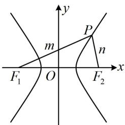
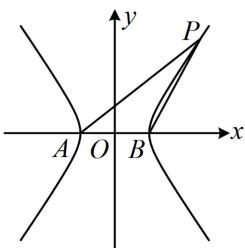
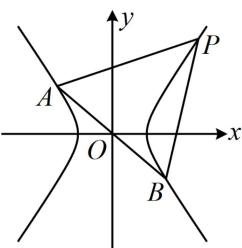
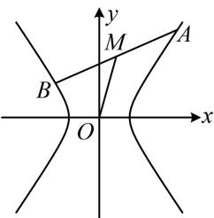
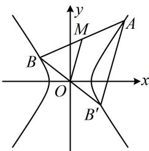

<!-- source-part:1 pages:1-6 -->

# 第 4 节 高考中双曲线常用的二级结论（★★★）

## 内容提要

解析几何中存在无数的二级结论，本节筛选出了一些在高考中比较常用的双曲线二级结论，记住这些结论可适当缩短解题时间.

1. 焦点三角形面积公式：如图1，设 $P$ 是双曲线 $\frac{x^2}{a^2} -\frac{y^2}{b^2} = 1(a > 0,b > 0)$ 上的一点， $F_{1}(-c,0)$ ， $F_{2}(c,0)$ 分别是双曲线的左、右焦点， $\angle F_{1}PF_{2} = \theta$ ，则 $S_{\triangle PF_1F_2} = c|y_P| = \frac{b^2}{\tan\frac{\theta}{2}}.$

  
图1

  
图2

  
图3

证明：一方面， $\triangle PF_{1}F_{2}$ 的边 $F_{1}F_{2}$ 上的高 $h = |y_{P}|$ ，所以 $S_{\triangle PF_{1}F_{2}} = \frac{1}{2} |F_{1}F_{2}| \cdot h = \frac{1}{2} \cdot 2c \cdot |y_{P}| = c |y_{P}|$ ；

另一方面，记 $\left|PF_{1}\right|=m,\quad\left|PF_{2}\right|=n$ ，则 $\left|m-n\right|=2a$ ①，

在 $\triangle PF_{1}F_{2}$ 中，由余弦定理， $\left|F_{1}F_{2}\right|^{2} = \left|PF_{1}\right|^{2} + \left|PF_{2}\right|^{2} - 2\left|PF_{1}\right|\cdot \left|PF_{2}\right|\cdot \cos \angle F_{1}PF_{2}$ ，

所以 $4c^{2} = m^{2} + n^{2} - 2mn\cos \theta = (m - n)^{2} + 2mn - 2mn\cos \theta = (m - n)^{2} + 2mn(1 - \cos \theta)$ ②，

将式①代入式②可得： $4c^{2}=4a^{2}+2mn(1-\cos\theta)$ ，所以 $mn=\frac{4c^{2}-4a^{2}}{2(1-\cos\theta)}=\frac{2b^{2}}{1-\cos\theta}$

故 $S_{\triangle PF_1F_2} = \frac{1}{2} mn\sin \theta = \frac{1}{2}\cdot \frac{2b^2}{1 - \cos\theta}\cdot \sin \theta = b^2\cdot \frac{\sin\theta}{1 - \cos\theta} = b^2\cdot \frac{2\sin\frac{\theta}{2}\cos\frac{\theta}{2}}{2\sin^2\frac{\theta}{2}} = \frac{b^2}{\tan\frac{\theta}{2}}.$

2. 基于双曲线第三定义的斜率积结论: 如上图 2, 设 A, B 分别是双曲线 $\frac{x^{2}}{a^{2}} - \frac{y^{2}}{b^{2}} = 1 (a > 0, b > 0)$ 的左、右顶点, P 是双曲线上不与 A, B 重合的任意一点, 则 $k_{PA} \cdot k_{PB} = \frac{b^{2}}{a^{2}}$ .

注：上述结论中 $A, B$ 是双曲线的左、右顶点，可将其推广为双曲线上关于原点对称的任意两点，如上图3，只要直线 $PA, PB$ 的斜率都存在，就仍然满足 $k_{PA} \cdot k_{PB} = \frac{b^2}{a^2}$ ，下面给出证明.

证明：设 $A(x_{1},y_{1})$ ， $P(x_{2},y_{2})$ ，则 $B(-x_{1},-y_{1})$ ，所以 $k_{PA} \cdot k_{PB} = \frac{y_{2} - y_{1}}{x_{2} - x_{1}} \cdot \frac{y_{2} + y_{1}}{x_{2} + x_{1}} = \frac{y_{2}^{2} - y_{1}^{2}}{x_{2}^{2} - x_{1}^{2}}$ ①，

因为点 $A$ 在双曲线上，所以 $\frac{x_1^2}{a^2} -\frac{y_1^2}{b^2} = 1,$

故 $y_{1}^{2}=b^{2}\left(\frac{x_{1}^{2}}{a^{2}}-1\right)=\frac{b^{2}}{a^{2}}(x_{1}^{2}-a^{2})$ ，同理， $y_{2}^{2}=\frac{b^{2}}{a^{2}}(x_{2}^{2}-a^{2})$

所以 $y_{2}^{2} - y_{1}^{2} = \frac{b^{2}}{a^{2}} (x_{2}^{2} - a^{2} - x_{1}^{2} + a^{2}) = \frac{b^{2}}{a^{2}} (x_{2}^{2} - x_{1}^{2})$ ，代入①得： $k_{PA}\cdot k_{PB} = \frac{b^2}{a^2}$

在上述条件中令 $A(-a,0)$ ， $B(a,0)$ ，即得内容提要第2点的特殊情况下的结论.

3. 中点弦斜率积结论：如图4， $AB$ 是双曲线 $\frac{x^2}{a^2} - \frac{y^2}{b^2} = 1 (a > 0, b > 0)$ 的一条不与坐标轴垂直且不过原点的弦， $M$ 为 $AB$ 中点，则 $k_{AB} \cdot k_{OM} = \frac{b^2}{a^2}$ ，此结论可用下面的点差法来证明.

  
图4

  
图5

证明：设 $A(x_{1},y_{1})$ ， $B(x_{2},y_{2})$ ， $x_{1}\neq x_{2}$ ， $y_{1}\neq y_{2}$ ，因为 $A,B$ 都在双曲线上，所以 $\left\{ \begin{array}{l} \frac{x_1^2}{a^2} -\frac{y_1^2}{b^2} = 1\\ \frac{x_2^2}{a^2} -\frac{y_2^2}{b^2} = 1 \end{array} \right.$ 两式作差得： $\frac{x_1^2 - x_2^2}{a^2} -\frac{y_1^2 - y_2^2}{b^2} = 0$ ，整理得： $\frac{y_1 - y_2}{x_1 - x_2}\cdot \frac{y_1 + y_2}{x_1 + x_2} = \frac{b^2}{a^2}$ ①，注意到 $\frac{y_1 - y_2}{x_1 - x_2} = k_{AB}$ ， $\frac{y_1 + y_2}{x_1 + x_2} = \frac{2y_M}{2x_M} = \frac{y_M}{x_M} = k_{OM}$ ，所以式①即为 $k_{AB}\cdot k_{OM} = \frac{b^2}{a^2}$

注：中点弦结论和上面的第三定义斜率积结论的结果都是 $\frac{b^2}{a^2}$ ，这是巧合吗？不是，两者之间有必然的联系。如上图5，设 $B'$ 为 $B$ 关于原点的对称点，则 $B'$ 也在该双曲线上，且 $O$ 为 $BB'$ 中点，结合 $M$ 为 $AB$ 中点可得 $OM \parallel AB'$ ，所以 $k_{AB} \cdot k_{OM} = k_{AB} \cdot k_{AB'}$ ，于是又回到了双曲线上的点 $A$ 与双曲线上关于原点对称的 $B$ 和 $B'$ 的连线的斜率积。

![[高中/总复习/教辅/一数常规版2026/第10章 解析几何/模块4 双曲线与方程/第4节 高考中双曲线常用的二级结论/类型01_焦点三角形面积/类型01_焦点三角形面积.md]]
![[高中/总复习/教辅/一数常规版2026/第10章 解析几何/模块4 双曲线与方程/第4节 高考中双曲线常用的二级结论/类型02_第三定义_中点弦斜率积结论/类型02_第三定义_中点弦斜率积结论.md]]
![[高中/总复习/教辅/一数常规版2026/第10章 解析几何/模块4 双曲线与方程/第4节 高考中双曲线常用的二级结论/强化训练/强化训练.md]]
