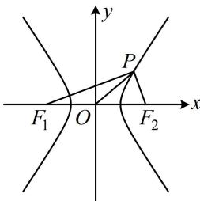

> [!faq]- 《第4节 高考中双曲线常用的二级结论》例题解析
>
> > [!success]- **【答案】** B
>
> > [!note]- **【分析】**
> > 本题未单列分析。
>
> > [!note]- **【解析】**
> > 解法1：求焦点三角形面积可考虑代公式 $S = \frac{b^2}{\tan\frac{\theta}{2}}$ ，但本题未给 $\angle F_{1}PF_{2}$ ，故先看能不能求出它，如图，双曲线 $C$ 的半焦距 $c = \sqrt{1 + 3} = 2 \Rightarrow |F_1F_2| = 4$ ，因为 $|OP| = 2$ ，所以 $|OP| = \frac{1}{2}|F_1F_2|$ ，
> >
> > 从而 $\angle F_{1}PF_{2} = 90^{\circ}$ ，故 $S_{\triangle PF_1F_2} = \frac{b^2}{\tan\frac{\theta}{2}} = \frac{3}{\tan45^\circ} = 3.$
> >
> > 解法2：也可考虑代公式 $S = c|y_{P}|$ 求 $\triangle PF_1F_2$ 的面积，于是先算 $y_{P}$ 因为 $|OP| = 2$ ，所以 $\sqrt{x_P^2 + y_P^2} = 2$ ①，又点 $P$ 在双曲线 $C$ 上，所以 $x_{P}^{2} - \frac{y_{P}^{2}}{3} = 1$ ②，联立①②解得： $y_{P} = \pm \frac{3}{2}$ ，双曲线 $C$ 的半焦距 $c = \sqrt{1 + 3} = 2$ ，所以 $S_{\triangle PF_1F_2} = c|y_P| = 3.$
> >
> > 
