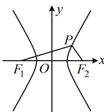

> [!faq]- 《第4节 高考中双曲线常用的二级结论》例题解析
>
> > [!success]- **【答案】** 详见解析
>
> > [!note]- **【分析】**
> > 本题未单列分析。
>
> > [!note]- **【解析】**
> > 解析：给出 $\angle F_{1}PF_{2}$ ，可由 $S = \frac{b^{2}}{\tan\frac{\theta}{2}}$ 求出 $\triangle PF_{1}F_{2}$ 的面积，再由 $S = c|y_{P}|$ 解出 $y_{P}$ ，
> >
> > 由题意，双曲线 $C$ 的半焦距 $c = 2$ ， $S_{\triangle PF_1F_2} = \frac{b^2}{\tan\frac{\theta}{2}} = \frac{3}{\tan60^\circ} = \sqrt{3}$
> >
> > 又 $S_{\triangle PF_1F_2} = c|y_P| = 2|y_P|$ ，所以 $2|y_P| = \sqrt{3}$ ，解得： $y_P = \pm \frac{\sqrt{3}}{2}$ ；
> >
> > 再求 $\left|PF_{1}\right|$ ，涉及 $\left|PF_{1}\right|$ ，可联想到由双曲线定义，如图，由双曲线定义， $\left|PF_{1}\right|-\left|PF_{2}\right|=2$ ①，
> > 只需再找一个关于 $\left|PF_{1}\right|$ 和 $\left|PF_{2}\right|$ 的方程，就能求出 $\left|PF_{1}\right|$ ，由于已知 $S_{\triangle PF_{1}F_{2}}$ ，故将它用 $\left|PF_{1}\right|$ 和 $\left|PF_{2}\right|$ 表示，
> >
> > 因为 $S_{\triangle PF_1F_2} = \frac{1}{2}\left|PF_1\right|\cdot \left|PF_2\right|\cdot \sin \angle F_1PF_2 = \frac{\sqrt{3}}{4}\left|PF_1\right|\cdot \left|PF_2\right| = \sqrt{3}$ ，所以 $\left|PF_1\right|\cdot \left|PF_2\right| = 4$ ②，由①可得 $\left|PF_2\right| = \left|PF_1\right| - 2$ ，代入②整理得： $\left|PF_1\right|^2 -2\left|PF_1\right| - 4 = 0$ ，解得： $\left|PF_1\right| = 1 + \sqrt{5}$ 或 $1 - \sqrt{5}$ （舍去）.答案： $\pm \frac{\sqrt{3}}{2},1 + \sqrt{5}$
> >
> > 
>
> > [!tip]- **【反思】**
> > 从上面两道题可以看出，当题干给出 $\angle F_{1}PF_{2}$ 时，可用 $S_{\triangle PF_1F_2} = \frac{b^2}{\tan\frac{\theta}{2}}$ （其中 $\theta = \angle F_{1}PF_{2}$ ）来算焦点三角形的面积；由 $S_{\triangle PF_1F_2} = c|y_P| = \frac{b^2}{\tan\frac{\theta}{2}}$ 还可以建立顶角 $\theta$ 和 $|y_P|$ 之间的等量关系.
