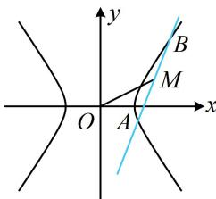

> [!faq]- 《第4节 高考中双曲线常用的二级结论》例题解析
>
> > [!success]- **【答案】** 3x-y-5=0
>
> > [!note]- **【分析】**
> > 本题未单列分析。
>
> > [!note]- **【解析】**
> > 解析：条件涉及弦中点，想到中点弦斜率积结论，
> > 因为 $M(2,1)$ 是弦 AB 的中点，所以 $k_{AB} \cdot k_{OM} = k_{AB} \cdot \frac{1}{2} = \frac{3}{2}$ ，故 $k_{AB} = 3$ ，
> > 如图，直线 AB 过点 M，故其方程为 $y-1=3(x-2)$ ，整理得：3x-y-5=0.
> >
> >
> > 
>
> > [!tip]- **【反思】**
> > 在双曲线中，涉及弦中点的问题都可以考虑用中点弦斜率积结论来建立方程，求解需要的量.
