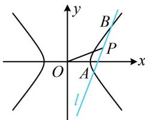

> [!faq]- 《第4节 高考中双曲线常用的二级结论》例题解析
>
> > [!success]- **【答案】** $(0,1)\cup (\sqrt{2}, + \infty)$
>
> > [!note]- **【分析】**
> > 本题未单列分析。
>
> > [!note]- **【解析】**
> > 解析：涉及弦中点，想到中点弦斜率积结论，由题意， $k_{AB}\cdot k_{OP} = k_{AB}\cdot \frac{1}{m} = 1$ ，所以 $k_{AB} = m$ 如图，直线 $l$ 过点 $P$ ，故其方程为 $y - 1 = m(x - m)$ ，整理得： $y = mx + 1 - m^2$
> >
> > 直线 $l$ 是随 $m$ 而变化的动直线，且应满足 $l$ 与 $C$ 有两个交点，于是联立方程用 $\Delta > 0$ 来求 $m$ 的范围，
> >
> > 联立 $\left\{ \begin{array}{l} y = mx + 1 - m^2 \\ x^2 - y^2 = 1 \end{array} \right.$ 消去 $y$ 整理得： $(1 - m^2)x^2 - 2m(1 - m^2)x + 2m^2 - 2 - m^4 = 0$
> >
> > 因为直线 l 与双曲线 C 有 2 个交点，
> >
> > 所以 $\left\{ \begin{array}{ll}1 - m^2\neq 0 & ①\\ \Delta = 4m^2 (1 - m^2)^2 -4(1 - m^2)(2m^2 -2 - m^4) > 0 & ② \end{array} \right.$
> >
> > 由①得 $m \neq \pm 1$ ，由②得 $(1 - m^2)[m^2(1 - m^2) - 2m^2 + 2 + m^4] = (1 - m^2)(2 - m^2) > 0$ ，所以 $m^2 < 1$ 或 $m^2 > 2$ ，结合 $m > 0$ 可得 $0 < m < 1$ 或 $m > \sqrt{2}$ .
> >
> >
> > 
