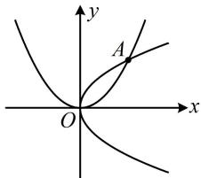

> [!faq]- 《第1节 抛物线定义、标准方程及简单几何性质》参考答案
>
> > [!success]- **【答案】** C
>
> > [!note]- **【分析】**
> > 本题未单列分析。
>
> > [!note]- **【解析】**
> > $y^{2} = 2x$ 或 $x^{2} = 2y$
> >
> > 解析：没有规定开口，则过点 $A(2,2)$ 的抛物线有如图所示的两种情况，下面分别考虑，若开口向右，可设抛物线 $C$ 的方程为 $y^{2} = 2px(p > 0)$ ，将点 $A(2,2)$ 代入可得： $2^{2} = 2p \cdot 2$ ，解得： $p = 1$ ，所以抛物线 $C$ 的方程为 $y^{2} = 2x$ ；若开口向上，可设抛物线 $C$ 的方程为： $x^{2} = 2my(m > 0)$ ，将点 $A(2,2)$ 代入可得： $2^{2} = 2m \cdot 2$ ，解得： $m = 1$ ，
> >
> > 所以抛物线 C 的方程为 $x^{2}=2y$ ;
> >
> > 综上所述，抛物线 C 的方程为 $y^{2}=2x$ 或 $x^{2}=2y$ .
> >
> > 
