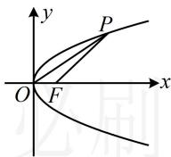

> [!faq]- 《第1节 抛物线定义、标准方程及简单几何性质》参考答案
>
> > [!success]- **【答案】** $x = -1$
>
> > [!note]- **【分析】**
> > 本题未单列分析。
>
> > [!note]- **【解析】**
> > 解析：如图，给了点 $P$ 的横坐标，可代入抛物线的方程求其纵坐标，并用它计算 $\triangle OFP$ 的面积，
> >
> > $x_{P} = 8 \Rightarrow y_{P}^{2} = 2px_{P} = 16p \Rightarrow y_{P} = \pm 4\sqrt{p}$ ，又 $\left|OF\right| = \frac{p}{2}$
> >
> > 所以 $S_{\triangle OFP} = \frac{1}{2}\left|OF\right|\cdot \left|y_P\right| = \frac{1}{2}\times \frac{p}{2}\times 4\sqrt{p} = p\sqrt{p}$
> >
> > 由题意， $S_{\triangle OFP} = 2\sqrt{2}$ ，所以 $p\sqrt{p} = 2\sqrt{2}$ ，故 $p = 2$
> >
> > 所以抛物线的准线方程为 x = -1.
> >
> > 
