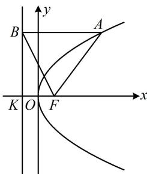

> [!faq]- 《第1节 抛物线定义、标准方程及简单几何性质》参考答案
>
> > [!success]- **【答案】** C
>
> > [!note]- **【分析】**
> > 本题未单列分析。
>
> > [!note]- **【解析】**
> > C
> >
> > 解析：如图， $F$ 在 $x$ 轴上，故可先用所给直线与 $x$ 轴联立，求出交点 $F$ 的坐标，
> >
> > 联立 $\left\{ \begin{array}{l} y = -2x + 2 \\ y = 0 \end{array} \right.$ 解得： $\left\{ \begin{array}{l} x = 1 \\ y = 0 \end{array} \right.$ ，所以 $F(1,0)$ ，
> >
> > 从而 $\frac{p}{2} = 1 \Rightarrow p = 2$ ，故抛物线 $C$ 的方程为 $y^{2} = 4x$ ，
> >
> > 求 $|AF|$ 需要 A 的横坐标, 怎么求? 观察图形发现 B 的横坐标容易获得, 代入所给直线方程可求得其纵坐标, A, B 纵坐标相等, 代入抛物线方程可求得 A 的横坐标,
> >
> > 抛物线的准线为 $x = -1$ ，所以 $x_{B} = -1$
> >
> > 从而 $y_{B} = -2x_{B} + 2 = 4$ ，故 $y_{A} = 4$
> >
> > 又 $A$ 在抛物线 $C$ 上，所以 $x_{A} = \frac{y_{A}^{2}}{4} = 4$
> >
> > 故 $\left|AF\right|=x_{A}+\frac{p}{2}=4+1=5$ .
> >
> > 
