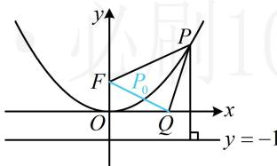

> [!faq]- 《第1节 抛物线定义、标准方程及简单几何性质》参考答案
>
> > [!success]- **【答案】** C
>
> > [!note]- **【分析】**
> > 本题未单列分析。
>
> > [!note]- **【解析】**
> > C
> >
> > 解析：如图，直接分析 $y + |PQ|$ 的最小值不易，可考虑把 $y$ 凑成 $y + 1$ ，用定义转化为 $|PF|$ 再看，抛物线的焦点为 $F(0,1)$ ，准线为 $y = -1$ ，由抛物线定义， $|PF| = y + 1$ ，所以 $y = |PF| - 1$ ，故 $y + |PQ| = |PF| - 1 + |PQ| = |PF| + |PQ| - 1$ ①，由三角形两边之和大于第三边可得 $|PF| + |PQ| \geq |FQ|$ ，结合①得 $y + |PQ| \geq |FQ| - 1 = \sqrt{(2\sqrt{2} - 0)^2 + (0 - 1)^2} - 1 = 2$ ，取等条件是 $P$ 与图中 $P_0$ 重合，所以 $(y + |PQ|)_{\min} = 2$ .
> >
> > 
