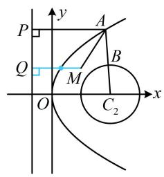

> [!faq]- 《第1节 抛物线定义、标准方程及简单几何性质》参考答案
>
> > [!success]- **【答案】** 2
>
> > [!note]- **【分析】**
> > 本题未单列分析。
>
> > [!note]- **【解析】**
> > 解析：如图，A, B 都是动点，不好分析，可先取定一个。由于圆上动点到圆外定点的距离最值比较好求，故先取定 A，由图可知， $|AB| \geq |AC_{2}| - 1$ ，
> >
> > 所以 $\left|AM\right|+\left|AB\right|\geq\left|AM\right|+\left|AC_{2}\right|-1$ ①,
> >
> > 再求 $\left|AM\right|+\left|AC_{2}\right|$ 的最小值，直接分析不易，注意到 $C_{2}(2,0)$ 恰好是抛物线的焦点，故又可用抛物线定义将 $\left|AC_{2}\right|$ 转化为A到准线的距离来看，
> >
> > 如图，作 $AP \perp$ 准线 $x = -2$ 于 $P$ ， $MQ \perp$ 准线于 $Q$
> >
> > 由抛物线定义， $\left|AC_{2}\right|=\left|AP\right|$ ，代入①可得
> >
> > $$
> > \left| A M \right| + \left| A B \right| \geq \left| A M \right| + \left| A P \right| - 1 \geq \left| M Q \right| - 1 = 3 - 1 = 2,
> > $$
> >
> > 当且仅当 $B$ 为线段 $AC_{2}$ 与圆的交点，且 $A$ 为线段 $QM$ 与抛物线交点时两个不等号同时取等号，所以 $\left|AM\right| + \left|AB\right|$ 的最小值为2.
> >
> > 
> >
> > 一数·必刷100讲
