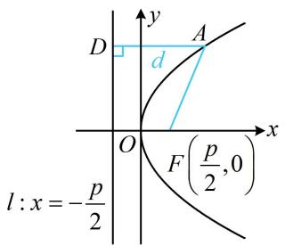
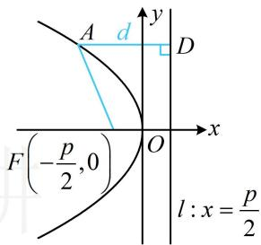
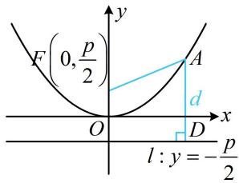
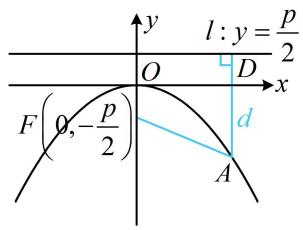

<!-- source-part:1 pages:1-5 -->

# 模块五 抛物线与方程

## 第1节 抛物线定义、标准方程及简单几何性质（★☆）

## 内容提要

1. 抛物线的定义: 平面上到定点 $F$ 的距离与到定直线 $l$ (不过定点 $F$ ) 的距离相等的点的轨迹是抛物线, 其中定点 $F$ 叫做抛物线的焦点, 定直线 $l$ 叫做抛物线的准线.

## 2. 抛物线的标准方程与简单几何性质:

<table><tr><td>定义</td><td>标准方程 $(p>0)$ </td><td>焦点</td><td>准线</td><td>范围</td><td>对称轴</td><td>顶点</td><td>图形</td></tr><tr><td rowspan="4"> $|AF|=d$ </td><td> $y^{2}=2px$ </td><td> $\left(\frac{p}{2},0\right)$ </td><td> $x=-\frac{p}{2}$ </td><td> $x≥0$  $y∈R$ </td><td>x轴</td><td>原点</td><td></td></tr><tr><td> $y^{2}=-2px$ </td><td> $\left(-\frac{p}{2},0\right)$ </td><td> $x=\frac{p}{2}$ </td><td> $x≤0$  $y∈R$ </td><td>x轴</td><td>原点</td><td></td></tr><tr><td> $x^{2}=2py$ </td><td> $\left(0,\frac{p}{2}\right)$ </td><td> $y=-\frac{p}{2}$ </td><td> $x∈R$  $y≥0$ </td><td>y轴</td><td>原点</td><td></td></tr><tr><td> $x^{2}=-2py$ </td><td> $\left(0,-\frac{p}{2}\right)$ </td><td> $y=\frac{p}{2}$ </td><td> $x∈R$  $y≤0$ </td><td>y轴</td><td>原点</td><td></td></tr></table>

3. 抛物线上的点到焦点 $F$ 的距离可用坐标表示，例如开口向右的抛物线 $y^{2} = 2px (p > 0)$ 中，若点 $A$ 在抛物线上，且 $AD \perp$ 准线于 $D$ ，如上表中第1个图，有 $\left|AF\right| = \left|AD\right| = x_{A} + \frac{p}{2}$ ，其余开口的抛物线类似.

![[高中/总复习/教辅/一数常规版2026/第10章 解析几何/模块5 抛物线与方程/第1节 抛物线定义、标准方程及简单几何性质/类型01_抛物线的标准方程与简单几何性质/类型01_抛物线的标准方程与简单几何性质.md]]
![[高中/总复习/教辅/一数常规版2026/第10章 解析几何/模块5 抛物线与方程/第1节 抛物线定义、标准方程及简单几何性质/类型02_抛物线定义的运用/类型02_抛物线定义的运用.md]]
![[高中/总复习/教辅/一数常规版2026/第10章 解析几何/模块5 抛物线与方程/第1节 抛物线定义、标准方程及简单几何性质/强化训练/强化训练.md]]
