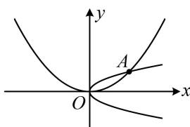

> [!faq]- 《第1节 抛物线定义、标准方程及简单几何性质》例题解析
>
> > [!success]- **【答案】** $y^{2} = \frac{1}{2} x$ 或 $x^{2} = 4y$
>
> > [!note]- **【分析】**
> > 本题未单列分析。
>
> > [!note]- **【解析】**
> > 解析：抛物线过点 $A(2,1)$ ，有如图所示的两种情况，下面分别考虑，
> >
> > 若开口向右，可设抛物线 $C$ 的方程为 $y^{2} = 2px(p > 0)$
> >
> > 将点 $A(2,1)$ 代入可得： $1^{2} = 2p \cdot 2$ ，解得： $p = \frac{1}{4}$ ，所以 $C$ 的方程为 $y^{2} = \frac{1}{2} x$ ；
> >
> > 若开口向上，可设抛物线 C 的方程为 $x^{2}=2my(m>0)$ ,
> >
> > 将点 $A(2,1)$ 代入可得： $2^{2} = 2m$ ，解得： $m = 2$ ，所以 $C$ 的方程为 $x^{2} = 4y$
> >
> > 
> >
> > 综上所述， $C$ 的方程为 $y^{2} = \frac{1}{2} x$ 或 $x^{2} = 4y$
