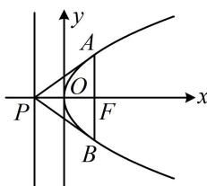

> [!faq]- 《第1节 抛物线定义、标准方程及简单几何性质》例题解析
>
> > [!success]- **【答案】** $\sqrt{2}$
>
> > [!note]- **【分析】**
> > 本题未单列分析。
>
> > [!note]- **【解析】**
> > 解析：如图，可以 $AB$ 为底， $PF$ 为高来计算 $\triangle PAB$ 的面积，下面先求 $|AB|$ ，
> >
> > 将 $x = \frac{p}{2}$ 代入 $y^{2} = 2px$ 解得： $y = \pm p$ ，所以 $\left|AB\right| = 2p$
> >
> > 又 $\left|PF\right|=p$ ，所以 $S_{\triangle PAB}=\frac{1}{2}\left|AB\right|\cdot\left|PF\right|=\frac{1}{2}\cdot2p\cdot p=p^{2}$
> >
> > 由题意， $S_{\triangle PAB}=2$ ，所以 $p^{2}=2$ ，故 $p=\sqrt{2}$ .
> >
> >
> > 
