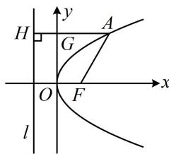

> [!faq]- 《第1节 抛物线定义、标准方程及简单几何性质》例题解析
>
> > [!success]- **【答案】** C
>
> > [!note]- **【分析】**
> > 本题未单列分析。
>
> > [!note]- **【解析】**
> > A. 2 B. 3 C. 6 D. 9
> >
> > 解析：如图，涉及抛物线上的点到焦点的距离，考虑抛物线的定义，设焦点为 $F\left(\frac{p}{2},0\right)$ ，准线为 $l:x=-\frac{p}{2}$ ，作 $AH\perp l$ 于H，交y轴于G，由抛物线定义， $|AH|=|AF|=12$ ，
> > 又 $|AG|=9$ ，所以 $|HG|=|AH|-|AG|=12-9=3$ ，即 $\frac{p}{2}=3$ ，故p=6.
> >
> > 
>
> > [!tip]- **【反思】**
> > 涉及抛物线上的点到焦点的距离问题，常常优先往抛物线定义上考虑.
