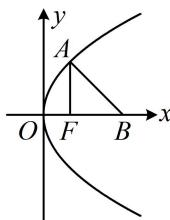

> [!faq]- 《第1节 抛物线定义、标准方程及简单几何性质》例题解析
>
> > [!success]- **【答案】** B
>
> > [!note]- **【分析】**
> > 本题未单列分析。
>
> > [!note]- **【解析】**
> > 解析：如图，只要求出 $|AF|$ ，就可结合抛物线定义求得A的坐标，进而求出 $|AB|$ ，由题意， $F(1,0)$ ， $B(3,0)$ ，所以 $|BF|=2$ ，因为 $|AF|=|BF|$ ，所以 $|AF|=2$ ，
> > 由内容提要 3， $|AF|=x_{A}+\frac{p}{2}=x_{A}+1$ ，所以 $x_{A}+1=2$ 从而 $x_{A}=1$ ，故 $y_{A}^{2}=4x_{A}=4$ ，故 $\left|AB\right|=\sqrt{(x_{A}-3)^{2}+y_{A}^{2}}=2\sqrt{2}$ .
> >
> > 
