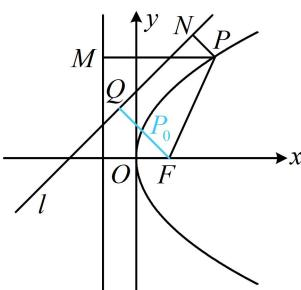

> [!faq]- 《第1节 抛物线定义、标准方程及简单几何性质》例题解析
>
> > [!success]- **【答案】** 详见解析
>
> > [!note]- **【分析】**
> > 本题未单列分析。
>
> > [!note]- **【解析】**
> > 解析：如图，直接分析 $d_{1} + d_{2}$ 的最小值不易，可考虑用定义将 $d_{1}$ 转化为 $\vert PF\vert$ 来看，
> >
> > 设抛物线的焦点为 $F(1,0)$ ，由抛物线的定义知 $d_{1} = |PF|$ ，所以 $d_{1} + d_{2} = |PF| + d_{2}$ ①，如图，过 $F$ 作 $FQ \perp l$ 于 $Q$ ，过 $P$ 作 $PN \perp l$ 于 $N$ ，则 $d_{2} = |PN|$ ，
> >
> > 代入①得： $d_{1} + d_{2} = |PF| + |PN|\geq |FQ| = \frac{|1 + 2|}{\sqrt{1^{2} + (-1)^{2}}} = \frac{3\sqrt{2}}{2},$
> >
> > 当且仅当点 $P$ 为线段 $FQ$ 与抛物线交点 $P_0$ 时取等号，所以 $(d_{1} + d_{2})_{\mathrm{min}} = \frac{3\sqrt{2}}{2}$ 答案： $\frac{3\sqrt{2}}{2}$
> >
> > 
>
> > [!tip]- **【总结】**
> > 只要涉及抛物线上的点到焦点的距离，不管问什么，最常见的思考方向都是利用定义转换长度.
