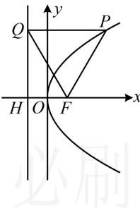

> [!faq]- 《第2节 抛物线定义与几何性质综合问题》参考答案
>
> > [!success]- **【答案】** A
>
> > [!note]- **【分析】**
> > 本题未单列分析。
>
> > [!note]- **【解析】**
> > 解析：如图，抛物线 C 的焦点为 $F(\sqrt{3},0)$ ，准线为 l： $x = -\sqrt{3}$ ，记 l 与 x 轴交于点 H，则 $\left|FH\right| = 2\sqrt{3}$ ，
> > 由抛物线定义， $\left|PQ\right|=\left|PF\right|$ 又 $\angle PFQ = 60^{\circ}$ ，所以 $\triangle PFQ$ 为正三角形，
> > 于是只需到 $\triangle HFQ$ 中求出 $\left|QF\right|$ ，即可得到 $\left|PF\right|$ ， $\angle PQF = 60^{\circ} \Rightarrow \angle HQF = 30^{\circ}$ ，所以 $\left|QF\right| = \frac{\left|FH\right|}{\sin \angle HQF}$ $=\frac{2\sqrt{3}}{\sin30^{\circ}}=4\sqrt{3}$ ，结合 $\triangle PFQ$ 为正三角形可得 $\left|PF\right|=4\sqrt{3}$
> >
> > 
