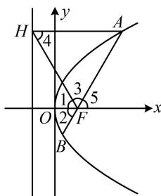

> [!faq]- 《第2节 抛物线定义与几何性质综合问题》参考答案
>
> > [!success]- **【答案】** $\sqrt{3}$
>
> > [!note]- **【分析】**
> > 本题未单列分析。
>
> > [!note]- **【解析】**
> > 解析：直线 $AB$ 的斜率即为图中 $\angle 5$ 的正切值，条件涉及角平分线，我们试试通过分析几何关系来求该角，
> >
> > 如图，因为 $\angle HFB$ 被 $x$ 轴平分，所以 $\angle 1 = \angle 2$
> >
> > 又由抛物线定义， $\left|AH\right|=\left|AF\right|$ ，所以 $\angle3=\angle4$ ，
> >
> > 因为 $AH \parallel x$ 轴，所以 $\angle 1 = \angle 4$ ，故 $\angle 1 = \angle 2 = \angle 3 = \angle 4$
> >
> > 又 $\angle 1 + \angle 2 + \angle 3 = 180^{\circ}$ ，所以 $\angle 2 = 60^{\circ}$
> >
> > 由图可知 $\angle5=\angle2$ ，所以 $\angle5=60^{\circ}$
> >
> > 故直线 AB 的斜率 $k = \tan 60^{\circ} = \sqrt{3}$ .
> >
> > 
