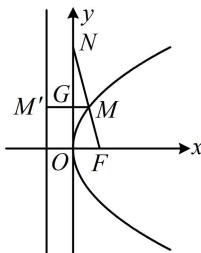

> [!faq]- 《第2节 抛物线定义与几何性质综合问题》参考答案
>
> > [!success]- **【答案】** 16
>
> > [!note]- **【分析】**
> > 本题未单列分析。
>
> > [!note]- **【解析】**
> > 解析：给出 $3\overrightarrow{FM} = 2\overrightarrow{MN}$ ，可设 $FM$ 的长，并用它表示其它线段的长，抛物线的准线为 $x = -4$ ，焦点为 $F(4,0)$
> >
> > 如图，作 $MM^{\prime} \perp$ 准线于 $M^{\prime}$ ，交 $y$ 轴于点 $G$
> >
> > 设 $\left|FM\right|=2m$ ，因为 $3\overrightarrow{FM}=2\overrightarrow{MN}$ ，所以 $\frac{\left|FM\right|}{\left|MN\right|}=\frac{2}{3}$
> >
> > 故 $\left|MN\right|=3m,\quad\left|FN\right|=5m$ ①,
> >
> > 由抛物线定义， $\left|MM'\right|=\left|FM\right|=2m$ ，
> >
> > $$
> > \left| M G \right| = \left| M M ^ {\prime} \right| - \left| M ^ {\prime} G \right| = 2 m - 4,
> > $$
> >
> > 从图形来看，可用相似比来建立关于 $m$ 的方程，
> >
> > 因为 $GM \parallel OF$ ，所以 $\frac{|GM|}{|OF|} = \frac{|MN|}{|FN|}$ ，
> >
> > 从而 $\frac{2m - 4}{4} = \frac{3m}{5m}$ ，故 $m = \frac{16}{5}$ ，代入①得 $|FN| = 16$ 。
> >
> > 
