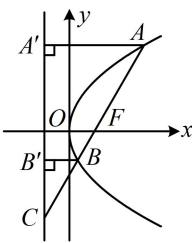

> [!faq]- 《第2节 抛物线定义与几何性质综合问题》参考答案
>
> > [!success]- **【答案】** $\frac{16}{3}$
>
> > [!note]- **【分析】**
> > 本题未单列分析。
>
> > [!note]- **【解析】**
> > 解析：如图，已知 $|AF|$ ，只需求得 $|BF|$ 即可求出 $|AB|$ ，可先过 $A$ ， $B$ 向准线作垂线，
> >
> > 作 $AA' \perp$ 准线于 $A'$ ， $BB' \perp$ 准线于 $B'$ ，
> >
> > 则 $\left|AA'\right| = \left|AF\right| = 4$ ， $\left|BB'\right| = \left|BF\right|$ ，接下来我们可以设一段长，利用几何关系来分析其它有关线段的长，
> >
> > 设 $\left|BB'\right|=\left|BF\right|=m$ ，因为F是AC中点，所以 $\left|AC\right|=2\left|AF\right|$
> >
> > $= 2\left|AA^{\prime}\right|$ ，从而 $\cos \angle CAA' = \frac{|AA'|}{|AC|} = \frac{1}{2}$ ，故 $\angle CAA' = 60^{\circ}$
> >
> > 又 $BB^{\prime} / / AA^{\prime}$ ，所以 $\angle CBB^{\prime} = 60^{\circ}$ ，故 $\left|BC\right| = \frac{\left|BB^{\prime}\right|}{\cos\angle CBB^{\prime}}$
> >
> > $= 2m$ ，所以 $\left|CF\right| = 3m$ ， $\left|AC\right| = 2\left|CF\right| = 6m$
> >
> > 又 $|AC|=2|AF|=8$ ，所以6m=8，故 $m=\frac{4}{3}$ ，
> >
> > 所以 $\left|BF\right|=\frac{4}{3}$ ，故 $\left|AB\right|=\left|AF\right|+\left|BF\right|=4+\frac{4}{3}=\frac{16}{3}$ .
> >
> > 
