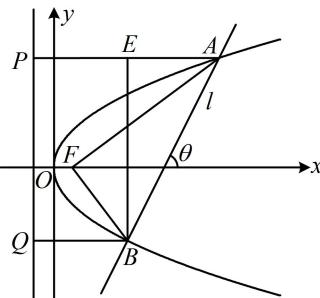

> [!faq]- 《第2节 抛物线定义与几何性质综合问题》参考答案
>
> > [!success]- **【答案】** D
>
> > [!note]- **【分析】**
> > 本题未单列分析。
>
> > [!note]- **【解析】**
> > 解析：条件给出 $|FA|=2|FB|$ ，想到过A和B分别作准线的垂线，结合抛物线定义处理，
> >
> > 如图，作 $AP \perp$ 准线于点 P， $BQ \perp$ 准线于点 Q，
> >
> > 则由抛物线定义， $\left|FA\right|=\left|AP\right|$ ， $\left|FB\right|=\left|BQ\right|$ ，
> >
> > 有大量的长度关系，于是考虑设其中一条线段的长，再用它表示其它线段的长，设 $|FB|=m$ ，则 $|FA|=2m$ ，所以 $|AP|=2m$ ， $|BQ|=m$ ，
> > 因为 $FA \perp FB$ ，所以 $\left|AB\right| = \sqrt{\left|FA\right|^2 + \left|FB\right|^2} = \sqrt{5}m$ ，
> >
> > 直线 $l$ 的斜率即为图中 $\theta$ 的正切值，由 $PA // x$ 轴不难发现 $\theta = \angle PAB$ ，故只需求 $\tan \angle PAB$ ，可考虑构造包含 $\angle PAB$ 的 Rt△来分析，
> >
> > 作 $BE \perp AP$ 于点 $E$ ，则 $|AE| = |AP| - |PE| = |AP| - |BQ| = m$ ， $|BE| = \sqrt{|AB|^2 - |AE|^2} = 2m$ ，所以在 $\triangle ABE$ 中，
> >
> > $\tan\angle EAB=\frac{|BE|}{|AE|}=\frac{2m}{m}=2$ ，故图中直线l的斜率为2，
> >
> > 由抛物线的对称性， $l$ 的斜率为-2时也满足题意，故选D.
> >
> > 
