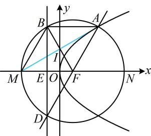

> [!faq]- 《第2节 抛物线定义与几何性质综合问题》参考答案
>
> > [!success]- **【答案】** 详见解析
>
> > [!note]- **【分析】**
> > 本题未单列分析。
>
> > [!note]- **【解析】**
> > $4 \sqrt{3}$
> >
> > 解法 1: 抛物线 $C: y^{2} = 4x$ 的焦点为 $F(1,0)$ ,
> >
> > 准线为 $l: x = -1$ ，设准线与 $x$ 轴交于点 $E$ ，则 $E(-1,0)$ ，
> >
> > 怎样翻译 $\overrightarrow{AB} = \overrightarrow{FM}$ ？有两个方向，一是从几何上来看，翻译成 $|AB| = |FM|$ 且 $AB // FM$ ，二是用坐标翻译，我们先试试前者，如图，因为 $\overrightarrow{AB} = \overrightarrow{FM}$ ，所以 $AB // FM$ ，且 $|AB| = |FM|$ ，
> >
> > 所以四边形 $ABMF$ 是平行四边形，
> >
> > 因为 $FM \perp l$ ，所以 $AB \perp l$ ，故 $|AB|$ 是点 $A$ 到抛物线准线的距离，由抛物线定义， $|AB| = |AF|$ ，又 $|AF| = |BF|$ ，所以 $|AB| = |AF| = |BF|$ ，从而 $\triangle ABF$ 是正三角形，故 $\triangle MBF$ 也是正三角形，所以四边形 $ABMF$ 是菱形，因为 $BE \perp MF$ ，所以 $E$ 为 $MF$ 中点，又 $|EF| = 2$ ，所以 $MF = 4$ ，设 $AM$ 与 $BF$ 交于点 $I$ ，则 $|AM| = 2|Ml| = 2 \times 4 \times \frac{\sqrt{3}}{2} = 4\sqrt{3}$ .
> >
> > 
> >
> > 解法2：再来试试用坐标翻译 $\overrightarrow{AB} = \overrightarrow{FM}$ ，方便起见，我们设圆的半径为未知数，结合 $\overrightarrow{AB} = \overrightarrow{FM}$ 来表示 $A$ ， $B$ 的坐标，设圆的半径为 $r(r > 0)$ ，由题意， $F(1,0)$ 所以圆 $F$ 的方程为 $(x - 1)^2 +y^2 = r^2$ ①，点 $B$ 在 $x = -1$ 上，在①中令 $x = -1$ 可得 $y = \pm \sqrt{r^2 - 4}$ 所以 $B(-1,\sqrt{r^2 - 4})$ ，故 $A(r - 1,\sqrt{r^2 - 4})$ ，代入 $y^{2} = 4x$ 得 $r^2 -4 = 4(r - 1)$ ，解得： $r = 4$ 或0（舍去），所以 $A(3,2\sqrt{3})$ ， $M(-3,0)$ 故 $\left|AM\right| = \sqrt{(-3 - 3)^2 + (0 - 2\sqrt{3})^2} = 4\sqrt{3}$ 数·必刷100讲
> >
> > 抛物线 $E: y^{2} = 4x$ 的焦点为 $F$ , 过 $F$ 的直线与 $E$ 交于 $A, B$ 两点, 延长 $FB$ 交 $E$ 的准线 $l$ 于点 $C$ , 过 $A, B$ 作 $l$ 的垂线, 垂足分别为 $M, N$ , 若 $\vert BC \vert = 2 \vert BN \vert$ , 则 $\triangle AFM$ 的面积为 ( )
> >
> > A. $4 \sqrt{3}$ B. 4 C. $2 \sqrt{3}$ D. 2
