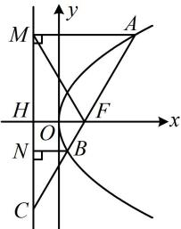

> [!faq]- 《第2节 抛物线定义与几何性质综合问题》参考答案
>
> > [!success]- **【答案】** A
>
> > [!note]- **【分析】**
> > 本题未单列分析。
>
> > [!note]- **【解析】**
> > A
> > 解析：如图，条件给出 $\left|BC\right|=2\left|BN\right|$ ，由抛物线定义还有 $\left|AM\right|=\left|AF\right|$ ， $\left|BN\right|=\left|BF\right|$ ，既然有这么多长度关系，那我们不妨设 AF 和 BF 的长，以此来分析图形的几何特征，
> > 设 $\left|AF\right|=m,\quad\left|BF\right|=n$ ，则 $\left|AM\right|=m,\quad\left|BN\right|=n$ 因为 $\left|BC\right|=2\left|BN\right|$ ，所以 $\left|BC\right|=2n,\quad\left|FC\right|=3n$ 且 $\cos\angle NBC=\frac{\left|BN\right|}{\left|BC\right|}=\frac{1}{2}$ ，故 $\angle NBC=\frac{\pi}{3}$ 又 AM//BN，所以 $\angle MAC = \frac{\pi}{3}$ 从而 $\cos\angle MAC=\frac{\left|AM\right|}{\left|AC\right|}=\frac{m}{m+3n}=\frac{1}{2}$ ，故 m=3n，
> >
> > 有了 $m$ 和 $n$ 的关系，就能分析 $F$ 在 $AC$ 上的位置，结合 $\vert FH\vert$ 是已知的，可由相似比求得 $\vert AM\vert$ 由题意，抛物线的焦点为 $F(1,0)$ ，准线为 $l: x = -1$ 所以 $\vert FH\vert = 2$ ，由 $m = 3n$ 知 $\vert AF\vert = \vert FC\vert$ 所以 $F$ 为 $AC$ 中点，又 $FH \parallel AM$ ，所以 $\vert AM\vert = 2\vert FH\vert = 4$ ，
> >
> > 由 $\angle MAC = \frac{\pi}{3}$ 和 $|AM| = |AF|$ 可得 $\triangle AFM$ 是正三角形，所以 $S_{\triangle AFM} = \frac{1}{2} \times 4 \times 4 \times \sin \frac{\pi}{3} = 4\sqrt{3}$ .
> >
> > 
