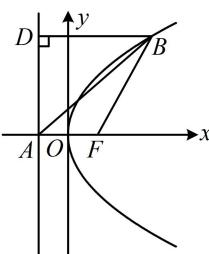
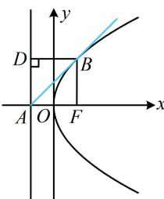

> [!faq]- 《第2节 抛物线定义与几何性质综合问题》参考答案
>
> > [!success]- **【答案】** A
>
> > [!note]- **【分析】**
> > 本题未单列分析。
>
> > [!note]- **【解析】**
> > A
> > 解析：抛物线的准线为 $x = -1 \Rightarrow p = 2 \Rightarrow$ 抛物线的方程为 $y^{2} = 4x$ ，其焦点为 $F(1,0)$ ， $A(-1,0)$ ，如图1，直接分析 $\frac{|BF|}{|AB|}$ 的最小值不易，涉及 $|BF|$ ，可用定义转化后再看，作 $BD \perp$ 准线于 D，则 $|BF| = |BD|$ ，所以 $\frac{|BF|}{|AB|} = \frac{|BD|}{|AB|} = \sin \angle BAD$ ，
> > 要使 $\sin\angle BAD$ 最小，只需 $\angle BAD$ 最小，此时直线 AB 与抛物线相切，如图2. 可联立直线和抛物线用 $\Delta = 0$ 求解，设切线 AB 的方程为 x = my - 1，联立 $\left\{\begin{aligned}x &=my-1 \\ y^{2}&=4x\end{aligned}\right.$ 消去 x 整理得： $y^{2}-4my+4=0$ ①，
> > 因为直线 AB 与抛物线相切，所以方程①的判别式 $\Delta = (-4m)^{2} - 4 \times 1 \times 4 = 0$ ，解得： $m = \pm 1$ ，
> > 代入①解得： $y = \pm 2$ ，所以 $y_{B} = \pm 2$ ，故 $S_{\triangle ABF} = \frac{1}{2}|AF| \cdot |y_{B}| = \frac{1}{2} \times 2 \times 2 = 2$ .
> >
> >   
> > 图1
> >
> >   
> > 图2
