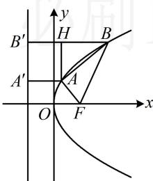

> [!faq]- 《第2节 抛物线定义与几何性质综合问题》参考答案
>
> > [!success]- **【答案】** 详见解析
>
> > [!note]- **【分析】**
> > 本题未单列分析。
>
> > [!note]- **【解析】**
> > 解法2：题干的条件也可用 $A$ 和 $B$ 的坐标来翻译，于是设坐标，设 $A(x_{1},y_{1})$ ， $B(x_{2},y_{2})$ ，则 $\left\{ \begin{array}{l} |AF| = x_1 + \frac{p}{2} = 7 \\ |BF| = x_2 + \frac{p}{2} = 25 \end{array} \right.$ 又 $FA \perp AB$ ，所以 $|AB| = \sqrt{|BF|^2 - |AF|^2} = \sqrt{25^2 - 7^2} = 24$ 故 $\sqrt{(x_2 - x_1)^2 + (y_2 - y_1)^2} = 24$ ③，观察发现用①②作差可求得 $x_{2} - x_{1}$ ，代入③又可求出 $y_{2} - y_{1}$ 由②-①可得： $x_{2} - x_{1} = 18$ ，代入③可得 $(y_{2} - y_{1})^{2} = 252$ 如图，由 $|BF| > |AF|$ 及 $A$ 、 $B$ 都在第一象限知 $y_{2} > y_{1}$ 所以 $y_{2} - y_{1} = 6\sqrt{7}$ ，故 $\tan \theta = \frac{y_2 - y_1}{x_2 - x_1} = \frac{6\sqrt{7}}{18} = \frac{\sqrt{7}}{3}$ 即 $\frac{\sin\theta}{\cos\theta} = \frac{\sqrt{7}}{3}$ ，结合 $\sin^2\theta +\cos^2\theta = 1$ 可解得 $\cos \theta = \pm \frac{3}{4}$ 由图可知直线 $AB$ 的倾斜角 $\theta$ 为锐角，故 $\cos \theta = \frac{3}{4}$
> >
> > 观察发现用①②作差可求得 $x_{2} - x_{1}$ ，代入③又可求出 $y_{2} - y_{1}$ ，故可先算 $AB$ 的斜率 $\tan \theta$ ，再求 $\cos \theta$ 由②-①可得： $x_{2} - x_{1} = 18$ ，代入③可得 $(y_{2} - y_{1})^{2} = 252$ 如图，由 $|BF| > |AF|$ 及 $A$ 、 $B$ 都在第一象限知 $y_{2} > y_{1}$ 所以 $y_{2} - y_{1} = 6\sqrt{7}$ ，故 $\tan \theta = \frac{y_2 - y_1}{x_2 - x_1} = \frac{6\sqrt{7}}{18} = \frac{\sqrt{7}}{3}$ 即 $\frac{\sin\theta}{\cos\theta} = \frac{\sqrt{7}}{3}$ ，结合 $\sin^2\theta +\cos^2\theta = 1$ 可解得 $\cos \theta = \pm \frac{3}{4}$
> >
> > 
