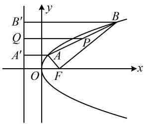

> [!faq]- 《第2节 抛物线定义与几何性质综合问题》参考答案
>
> > [!success]- **【答案】** C
>
> > [!note]- **【分析】**
> > 本题未单列分析。
>
> > [!note]- **【解析】**
> > 解析：如图，以 $AB$ 为直径的圆过 $F \Rightarrow FA \perp FB$ ，所以 $\left|AB\right| = \sqrt{\left|AF\right|^2 + \left|BF\right|^2}$ ，结合抛物线定义， $\left|PQ\right|$ 也可用 $\left|AF\right|$ 和 $\left|BF\right|$ 表示，故把它们设为变量，分析 $\frac{\left|PQ\right|}{\left|AB\right|}$ 的最大值，作 $PQ \perp$ 抛物线的准线于 $Q$ ， $AA' \perp$ 准线于 $A'$ ， $BB' \perp$ 准线于 $B'$ ，设 $\left|AF\right| = m$ ， $\left|BF\right| = n$ ，则 $\left|AA'\right| = m$ ， $\left|BB'\right| = n$ ， $\left|PQ\right| = \frac{\left|AA'\right| + \left|BB'\right|}{2} = \frac{m + n}{2}$ ， $\left|AB\right| = \sqrt{m^2 + n^2}$ ，所以 $\frac{\left|PQ\right|}{\left|AB\right|} = \frac{m + n}{2\sqrt{m^2 + n^2}} = \frac{1}{2}\sqrt{\frac{(m + n)^2}{m^2 + n^2}} = \frac{1}{2}\sqrt{\frac{m^2 + n^2 + 2mn}{m^2 + n^2}}$
> >
> > $$
> > = \frac {1}{2} \sqrt {1 + \frac {2 m n}{m ^ {2} + n ^ {2}}} \leq \frac {1}{2} \sqrt {1 + \frac {2 m n}{2 m n}} = \frac {\sqrt {2}}{2}
> > $$
> >
> > 当且仅当 $m = n$ 时取等号，故 $\frac{|PQ|}{|AB|}$ 的最大值为 $\frac{\sqrt{2}}{2}$ .
> >
> > 
> >
> > 一数·必刷100讲
