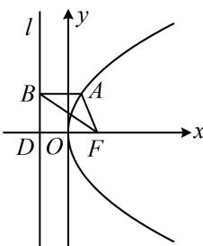

> [!faq]- 《第2节 抛物线定义与几何性质综合问题》例题解析
>
> > [!success]- **【答案】** B
>
> > [!note]- **【分析】**
> > 本题未单列分析。
>
> > [!note]- **【解析】**
> > 解析：如图，涉及抛物线上的点向准线作垂线，想到抛物线定义，
> > 由题意， $\left|AB\right|=\left|AF\right|$ ，又 $\angle FAB=\frac{2\pi}{3}$ ，所以 $\angle ABF=\angle AFB=\frac{\pi}{6}$ ，要求 $|BF|$ ，注意到 $\triangle BFD$ 为直角三角形且 $|FD|$ 已知，所以将条件转移到该三角形中来看，
> > 记准线与x轴交于点D，抛物线的焦点为 $F(3,0)$ ，准线为l:x=-3，所以 $|FD|=6$ ，
> > 由 $\angle ABF=\frac{\pi}{6}$ 可得 $\angle DBF=\frac{\pi}{3}$ ，所以 $\left|BF\right|=\frac{\left|FD\right|}{\sin\angle DBF}=\frac{6}{\sin\frac{\pi}{3}}=4\sqrt{3}$ .
> >
> > 
>
> > [!tip]- **【反思】**
> > 利用抛物线的定义可知，抛物线上的点 A 与焦点 F，以及点 A 在准线上的射影 B 所围成的三角形 ABF 是等腰三角形，且 FB 为 $\angle AFO$ 的角平分线.
