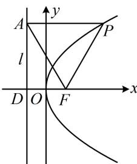

> [!faq]- 《第2节 抛物线定义与几何性质综合问题》例题解析
>
> > [!success]- **【答案】** 4
>
> > [!note]- **【分析】**
> > 本题未单列分析。
>
> > [!note]- **【解析】**
> > 解析：如图， $C$ 的焦点为 $F(1,0)$ ，准线为 $l:x = -1$ ，设 $l$ 与 $x$ 轴交于点 $D$ 由抛物线定义， $\left|PA\right| = \left|PF\right|$ ，又 $\left|PA\right| = \left|AF\right|$ ，所以 $\triangle PAF$ 是正三角形，要算 $\left|AF\right|$ ，图中已知的长度只有 $\left|FD\right|$ ，故放到 $\triangle ADF$ 中来看，因为 $\angle PAF = 60^{\circ}$ ，所以 $\angle DAF = 30^{\circ}$ 又 $\left|FD\right| = 2$ ，所以 $\left|AF\right| = \frac{\left|FD\right|}{\sin\angle DAF} = \frac{2}{\sin 30^{\circ}} = 4.$
> >
> > 
