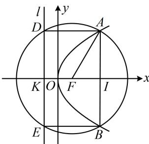

> [!faq]- 《第2节 抛物线定义与几何性质综合问题》例题解析
>
> > [!success]- **【答案】** 2
>
> > [!note]- **【分析】**
> > 本题未单列分析。
>
> > [!note]- **【解析】**
> > 解析：如图，已知 $|AB| = |DE| = 4\sqrt{3}$ ，可通过分析几何关系，求出点 $A$ 的坐标，代入抛物线方程求 $p$ ，因为 $|AB| = |DE| = 4\sqrt{3}$ ，所以 $AB$ ， $DE$ 是同一圆中等长的弦，结合对称性可得四边形 $ABED$ 是矩形，设准线 $l$ 与 $x$ 轴交于点 $K$ , $AB$ 与 $x$ 轴交于点 $I$ , 则 $\left|KF\right| = p$ ,
> >
> > 因为 $|AB| = |DE|$ ，所以 $|FI| = |KF| = p$ ，故 $|OI| = |OF| + |FI| = \frac{3p}{2}$ ，
> >
> > 又 $\left|AI\right|=\frac{1}{2}\left|AB\right|=2\sqrt{3}$ ，所以 $A\left(\frac{3p}{2},2\sqrt{3}\right)$ ,
> >
> > 代入抛物线方程可得： $(2\sqrt{3})^2 = 2p\cdot \frac{3p}{2}$ ，解得： $p = 2$ ：
> >
> > 
