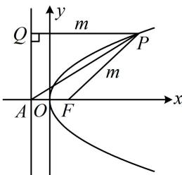

> [!faq]- 《第2节 抛物线定义与几何性质综合问题》例题解析
>
> > [!success]- **【答案】** $\frac{2\sqrt{3}}{3}$ ， $\frac{\sqrt{3}}{3}$
>
> > [!note]- **【分析】**
> > 本题未单列分析。
>
> > [!note]- **【解析】**
> > 解析：涉及 $|PF|$ ，常用抛物线定义转化为 $P$ 到准线的距离来分析，
> >
> > 如图，作 $PQ \perp$ 准线于 $Q$ ，因为 $\angle PAF = 30^{\circ}$ ，所以 $\angle PAQ = 60^{\circ}$
> >
> > 设 $\left|PF\right|=m$ ，则 $\left|PQ\right|=m$ ，所以 $\left|PA\right|=\frac{\left|PQ\right|}{\sin\angle PAQ}=\frac{m}{\sin60^{\circ}}=\frac{2\sqrt{3}m}{3}$ ，故 $\frac{\left|PA\right|}{\left|PF\right|}=\frac{2\sqrt{3}}{3}$
> >
> > 在 $\triangle PAF$ 中， $PA$ 和 $PF$ 所对的角恰好分别是 $\angle PFA$ 和 $\angle PAF$ ，故可用正弦定理求 $\sin \angle PFA$ ，由正弦定理， $\frac{|PA|}{\sin \angle PFA} = \frac{|PF|}{\sin \angle PAF}$ ，
> >
> > 所以 $\sin \angle PFA = \frac{|PA|\sin\angle PAF}{|PF|} = \frac{\frac{2\sqrt{3}m}{3}\times\frac{1}{2}}{m} = \frac{\sqrt{3}}{3}.$
> >
> > 
