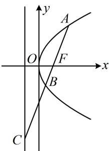

<!-- question-source:start -->
【变式 2】如图，过抛物线 $y^{2}=4x$ 的焦点 F 作直线与抛物线及其准线分别交于 A, B, C 三点，若 $\overrightarrow{FC}=4\overrightarrow{FB}$ ，则 $\left|AB\right|=\underline{\hspace{2cm}}$ .

<!-- question-source:end -->

![[高中/总复习/教辅/一数常规版2026/第10章 解析几何/模块5 抛物线与方程/第2节 抛物线定义与几何性质综合问题/类型02_定义与线段比例_相似相关/例题/answers/Q00049462A1.md]]
