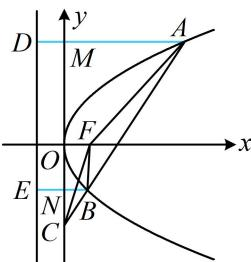

> [!faq]- 《第2节 抛物线定义与几何性质综合问题》例题解析
>
> > [!success]- **【答案】** A
>
> > [!note]- **【分析】**
> > 本题未单列分析。
>
> > [!note]- **【解析】**
> > A. $\frac{|BF|-1}{|AF|-1}$ B. $\frac{|BF|^{2}-1}{|AF|^{2}-1}$ C. $\frac{|BF|+1}{|AF|+1}$ D. $\frac{|BF|^{2}+1}{|AF|^{2}+1}$
> >
> > 解析：如图，两个三角形有相同的高（点 $F$ 到直线 $AC$ 的距离），故只需分析底边之比 $\frac{|BC|}{|AC|}$ 。选项中有 $|AF|$ 和 $|BF|$ ，由此想到抛物线定义，故过 $A, B$ 向准线作垂线，作出来就发现可用相似比来分析 $\frac{|BC|}{|AC|}$ ，
> >
> > 过 $A, B$ 作抛物线准线 $x = -1$ 的垂线分别交 $y$ 轴于 $M, N,$ 垂足分别为 $D, E,$ 则 $\triangle CBN \sim \triangle CAM$ ，所以 $\frac{|BC|}{|AC|} = \frac{|BN|}{|AM|} = \frac{|BE| - 1}{|AD| - 1}$ ①，由抛物线定义， $|BE| = |BF|$ ， $|AD| = |AF|$ ，代入①得： $\frac{|BC|}{|AC|} = \frac{|BF| - 1}{|AF| - 1}$ ，所以 $\frac{S_{\triangle BCF}}{S_{\triangle ACF}} = \frac{|BF| - 1}{|AF| - 1}$ .
> >
> > 
>
> > [!tip]- **【反思】**
> > 抛物线中与焦点 $F$ 有关的线段比例问题中，过抛物线上的点向准线作垂线，借助抛物线定义来分析图形的几何特征，是常规操作.
