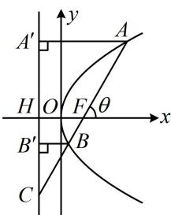

> [!faq]- 《第2节 抛物线定义与几何性质综合问题》例题解析
>
> > [!success]- **【答案】** $y=\sqrt{3}x-3\sqrt{3}$
>
> > [!note]- **【分析】**
> > 本题未单列分析。
>
> > [!note]- **【解析】**
> > 解析：如图，作 $AA' \perp$ 准线于 $A'$ ， $BB' \perp$ 准线于 $B'$ ，设准线与 $x$ 轴交于点 $H$ ，
> >
> > 先求直线 $AB$ 的倾斜角 $\theta$ ，可将 $|BC| = 2|BF|$ 转化为 $|BB'|$ 和 $|BC|$ 的关系，求得 $\angle CBB'$ ，该角等于 $\theta$ ，
> >
> > 由抛物线定义， $\left|BF\right|=\left|BB'\right|$ ，代入 $\left|BC\right|=2\left|BF\right|$ 可得 $\left|BC\right|=2\left|BB'\right|$ ，所以 $\cos\angle CBB'=\frac{\left|BB'\right|}{\left|BC\right|}=\frac{1}{2}$ ，
> >
> > 故 $\angle CBB' = 60^{\circ}$ ，又 $BB' // x$ 轴，所以 $\theta = 60^{\circ}$ ，故直线 $AB$ 的斜率 $k = \tan 60^{\circ} = \sqrt{3}$
> >
> > 求直线 $AB$ 的方程还差 $F$ 的坐标, 先求 $|HF|$ , 可利用相似比转化为求 $|AA'$ ,
> >
> > 因为 $AA' \parallel x$ 轴，所以 $\angle CAA' = \theta = 60^\circ$ ，故 $\left|AA'\right| = \left|AC\right|\cos \angle CAA' = \frac{1}{2}\left|AC\right|$ ①，由抛物线定义， $\left|AA'\right| = \left|AF\right|$ ，代入①可得 $\left|AF\right| = \frac{1}{2}\left|AC\right|$ ，所以 $F$ 为 $AC$ 中点，结合 $FH \parallel AA'$ 可得 $\left|FH\right| = \frac{1}{2}\left|AA'\right| = \frac{1}{2}\left|AF\right| = 6$ ，所以 $F(3,0)$ ，故直线 $AB$ 的方程为 $y = \sqrt{3}(x - 3)$ ，即 $y = \sqrt{3} x - 3\sqrt{3}$ .
> >
> > 
