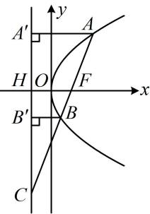

> [!faq]- 《第2节 抛物线定义与几何性质综合问题》例题解析
>
> > [!success]- **【答案】** $\frac{9}{2}$
>
> > [!note]- **【分析】**
> > 本题未单列分析。
>
> > [!note]- **【解析】**
> > 解析：抛物线的准线为 $x = -1$ ，焦点为 $F(1,0)$ ，设准线与 $x$ 轴交于点 $H$ ，则 $\vert FH\vert = 2$ 如图，作 $AA'\perp$ 准线于 $A'$ ， $BB'\perp$ 准线于 $B'$ ，则 $\vert AF\vert = \vert AA'\vert$ ， $\vert BF\vert = \vert BB'\vert$
> >
> > 题干给出 $\overrightarrow{FC} = 4\overrightarrow{FB}$ 这种线段比例式，可先设 $|BF|$ ，并求其它线段的长，再用相似比建立方程，设 $|BF| = m$ ，则 $|BB'| = m$ ，因为 $\overrightarrow{FC} = 4\overrightarrow{FB}$ ，所以 $|BC| = 3|BF| = 3m$ ， $|CF| = 4m$ ，
> >
> > 因为 $\triangle CBB' \sim \triangle CFH$ ，所以 $\frac{|BB'|}{|FH|} = \frac{|BC|}{|CF|}$ ，即 $\frac{m}{2} = \frac{3m}{4m}$ ，解得： $m = \frac{3}{2}$ ，所以 $|BF| = \frac{3}{2}$ ， $|CF| = 6$ ，
> >
> > 还需求出 $|AF|$ ，做法与求 $|BF|$ 类似，可设其为未知数，用相似比来建立方程求解，
> >
> > 设 $\left|AF\right|=\left|AA'\right|=n$ ，则 $\left|AC\right|=\left|AF\right|+\left|CF\right|=n+6$ ，
> >
> > 由 $\triangle CFH\sim \triangle CAA^{\prime}$ 可得 $\frac{|CF|}{|AC|} = \frac{|FH|}{|AA'|}$ ，即 $\frac{6}{n + 6} = \frac{2}{n}$ ，解得： $n = 3$
> >
> > 所以 $\left|AF\right|=3$ ，故 $\left|AB\right|=\left|AF\right|+\left|BF\right|=3+\frac{3}{2}=\frac{9}{2}$ .
> >
> > 
>
> > [!tip]- **【反思】**
> > 抛物线小题中出现未知长度的比例关系时, 往往可设一段长, 利用定义以及相似等几何性质求解其它线段的长.
