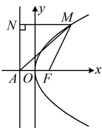
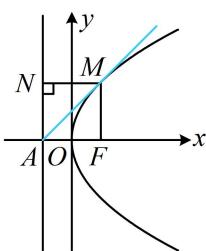

类型Ⅱ：定义与线段比例、相似相关

  
图1

  
图2

![[高中/总复习/教辅/一数常规版2026/第10章 解析几何/模块5 抛物线与方程/第2节 抛物线定义与几何性质综合问题/类型02_定义与线段比例_相似相关/例题/Q00049460.md]]
![[高中/总复习/教辅/一数常规版2026/第10章 解析几何/模块5 抛物线与方程/第2节 抛物线定义与几何性质综合问题/类型02_定义与线段比例_相似相关/例题/Q00049461.md]]
![[高中/总复习/教辅/一数常规版2026/第10章 解析几何/模块5 抛物线与方程/第2节 抛物线定义与几何性质综合问题/类型02_定义与线段比例_相似相关/例题/Q00049462.md]]
