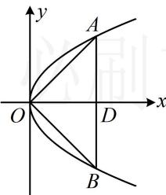

> [!faq]- 《第3节 抛物线小题的综合运算》参考答案
>
> > [!success]- **【答案】** D
>
> > [!note]- **【分析】**
> > 本题未单列分析。
>
> > [!note]- **【解析】**
> > 解法1：条件 $\overrightarrow{OA} \cdot \overrightarrow{OB} = 0$ 可用 $A, B$ 的坐标翻译，考虑到 $l \perp x$ 轴，可设 $l$ 的方程，与抛物线联立求 $A, B$ 的坐标，由题意，可设直线 $l$ 的方程为 $x = t(t > 0)$ ，代入 $y^2 = 2px$ 可得： $y^2 = 2pt$ ，解得： $y = \pm \sqrt{2pt}$ ，不妨设 $A(t, \sqrt{2pt})$ ， $B(t, -\sqrt{2pt})$ ，则 $\left\{ \begin{array}{l} |AB| = 2\sqrt{2pt} = 4 \\ \overrightarrow{OA} \cdot \overrightarrow{OB} = t^2 + \sqrt{2pt} \cdot (-\sqrt{2pt}) = t^2 - 2pt = 0 \end{array} \right.$ ，由②结合 $t > 0$ 可得： $t = 2p$ ，代入①解得： $p = 1$ 。解法2： $\overrightarrow{OA} \cdot \overrightarrow{OB} = 0$ 意味着 $OA \perp OB$ ，由对称性，结合 $|AB| = 4$ 可找到 $A$ 的坐标，代入抛物线方程即可求出 $p$ ，设直线 $l$ 与 $x$ 轴交于点 $D$ ，由对称性， $|OA| = |OB|$ ，又 $\overrightarrow{OA} \cdot \overrightarrow{OB} = 0$ ，所以 $OA \perp OB$ ，故 $\triangle AOB$ 为等腰直角三角形，所以 $\triangle AOD$ 也是等腰直角三角形，因为 $|AB| = 4$ ，所以 $|OD| = |AD| = 2$ ，故 $A(2,2)$ ，代入 $y^2 = 2px$ 可得： $2^2 = 2p \cdot 2$ ，解得： $p = 1$ 。
> >
> > 
