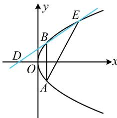

> [!faq]- 《第3节 抛物线小题的综合运算》参考答案
>
> > [!success]- **【答案】** B
>
> > [!note]- **【分析】**
> > 本题未单列分析。
>
> > [!note]- **【解析】**
> > 解析：如图，抛物线的准线为 $x = -1$ ，所以 $D(-1,0)$ 还知道点 $E$ ，于是可写出直线 $DE$ 的方程，与抛物线联立求 $B$ 的坐标，又 $E(4,4)$ ，所以 $k_{DE} = \frac{0 - 4}{-1 - 4} = \frac{4}{5}$ 故直线 $DE$ 的方程为 $y = \frac{4}{5} (x + 1)$ ，即 $4x = 5y - 4$ 代入 $y^{2} = 4x$ 消去 $x$ 整理得： $y^{2} - 5y + 4 = 0$ 解得： $y = 1$ 或4，因为 $y_{E} = 4$ ，所以 $y_{B} = 1$ 又点 $B$ 在抛物线 $C$ 上，所以 $x_{B} = \frac{y_{B}^{2}}{4} = \frac{1}{4}$ ，故 $B\left(\frac{1}{4},1\right)$ 此时可由对称性求得 $A$ 的坐标，结合点 $E$ 写出直线 $AE$ 的方程，由对称性知点 $A$ 的坐标为 $\left(\frac{1}{4}, - 1\right)$
> >
> > 所以 $k_{AE} = \frac{-1 - 4}{\frac{1}{4} - 4} = \frac{4}{3}$ ，故 $AE$ 的方程为 $y - 4 = \frac{4}{3}(x - 4)$
> >
> > 整理得：4x-3y-4=0.
> >
> > 
