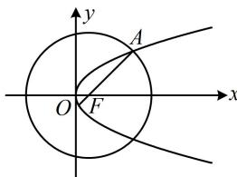

> [!faq]- 《第3节 抛物线小题的综合运算》参考答案
>
> > [!success]- **【答案】** $\frac{4}{5}$
>
> > [!note]- **【分析】**
> > 本题未单列分析。
>
> > [!note]- **【解析】**
> > 解析：由题意， $F(1,0)$ ，又因为抛物线 $y^{2} = 2px (p > 0)$ 的焦点坐标为 $\left(\frac{p}{2}, 0\right)$ ，所以 $\frac{p}{2} = 1$ ，故 $p = 2$ ，
> >
> > 如图，求 $O$ 到 $AF$ 的距离需要 $AF$ 的方程，已知 $F$ ，求该方程还差 $A$ 的坐标，故联立圆和抛物线求 $A$ 的坐标，
> >
> > 联立 $\left\{ \begin{array}{l}(x - 1)^2 +y^2 = 25\\ y^2 = 4x \end{array} \right.$ 消去 $y$ 整理得： $x^{2} + 2x - 24 = 0$
> >
> > 解得： $x = 4$ 或-6（舍去），所以 $y = \pm 2\sqrt{x} = \pm 4$
> >
> > 由对称性，不妨假设 $A(4,4)$ ，则 $k_{AF} = \frac{4 - 0}{4 - 1} = \frac{4}{3}$
> >
> > 直线 $AF$ 的方程为 $y = \frac{4}{3} (x - 1)$ ，即 $4x - 3y - 4 = 0$ ，
> >
> > 所以原点到直线 $AF$ 的距离 $d = \frac{|-4|}{\sqrt{4^2 + (-3)^2}} = \frac{4}{5}$ .
> >
> > 
