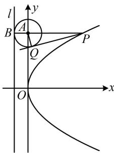
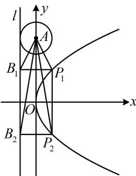

> [!faq]- 《第3节 抛物线小题的综合运算》参考答案
>
> > [!success]- **【答案】** ABD
>
> > [!note]- **【分析】**
> > 本题未单列分析。
>
> > [!note]- **【解析】**
> > 解法1：A项，抛物线的准线为l:x=-1，
> > 圆A的半径r=1，圆心A(0,4)到l的距离d=1=r，
> > 所以准线l与⊙A相切，故A项正确；
> > B项，|PQ|是切线长，故求|PQ|的核心是求|PA|，我们画图来看，当P，A，B三点共线时，如图1， $PA\perp y$ 轴，
> > 所以PA的方程为y=4，代入 $y^{2}=4x$ 可得x=4，
> > 所以 $|PA|=4$ ，又因为 $|AQ|=1$ ，所以 $|PQ|=\sqrt{|PA|^{2}-|AQ|^{2}}$ $=\sqrt{15}$ ，故B项正确；
> > C项， $|PB|=x_{p}+1=2\Rightarrow x_{p}=1$ ，如图2，满足条件的点P有 $P_{1}$ ， $P_{2}$ 两个，对应的B也有两个，分别为 $B_{1}$ ， $B_{2}$ ，
> > 故只需判断 $P_{1}A\perp AB_{1}$ 和 $P_{2}A\perp AB_{2}$ 是否成立，涉及垂直关系，可考虑用斜率积来判断，
> > 将x=1代入 $y^{2}=4x$ 得 $y=\pm2$ ，所以 $P_{1}(1,2)$ ， $B_{1}(-1,2)$ ， $P_{2}(1,-2)$ ， $B_{2}(-1,-2)$ ，从而 $k_{P_{1}A}\cdot k_{AB_{1}}=\frac{2-4}{1-0}\times\frac{2-4}{-1-0}$ $=-4\neq-1,\quad k_{P_{2}A}\cdot k_{AB_{2}}=\frac{-2-4}{1-0}\times\frac{-2-4}{-1-0}=-36\neq-1$ 故 $P_{1}A$ 与 $AB_{1}$ 不垂直， $P_{2}A$ 与 $AB_{2}$ 不垂直，故C项错误；
> > D项，怎样翻译 $|PA|=|PB|$ ？这些长度都能用坐标方便地计算，故可考虑设坐标，直接用坐标翻译它，
> > 设 $P\left(\frac{t^{2}}{4},t\right)$ ，则 $B(-1,t)$ ，因为 $|PA|=|PB|$ ，
> > 所以 $\sqrt{\frac{t^{4}}{16}+(t-4)^{2}}=\frac{t^{2}}{4}+1$ ，解得： $t=8\pm\sqrt{34}$ 所以满足题意的P有且仅有2个，故D项正确.
> > 解法2：A、B、C三项的分析同解法1，对于D项，在 $|PA|=|PB|$ 中，P，B都是动点，不好分析，但若注意到 $|PB|$ 是P到准线的距离，则可转化为P到焦点的距离，那么动点就只有P了，也可按此考虑，
> > 由题意，抛物线的焦点为 $F(1,0)$ ，因为 $|PA|=|PB|$ ，所以 $|PA|=|PF|$ ，故点P在AF的中垂线上，
> > 于是AF的中垂线与抛物线有几个交点，满足题意的P就有几个，故可求出该中垂线，与抛物线联立， $k_{AF}=\frac{4-0}{0-1}=-4$ ，所以AF中垂线的斜率为 $\frac{1}{4}$ ，又AF中点为 $\left(\frac{1}{2},2\right)$ ，所以AF的中垂线为 $y-2=\frac{1}{4}\left(x-\frac{1}{2}\right)$
> >
> > 即 $x = 4y - \frac{15}{2}$ ，代入 $y^{2} = 4x$ 整理得： $y^{2} - 16y + 30 = 0$
> >
> > 解得： $y = 8 \pm \sqrt{34}$ ，所以满足题意的 $P$ 有且仅有2个，
> >
> > 故D项正确.
> >
> >   
> > 图1
> >
> >   
> > 图2
