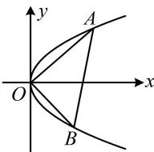

> [!faq]- 《第3节 抛物线小题的综合运算》参考答案
>
> > [!success]- **【答案】** C
>
> > [!note]- **【分析】**
> > 本题未单列分析。
>
> > [!note]- **【解析】**
> > 解析：$|OA|\cdot|OB|$ 可用 A, B 的坐标来算，故设坐标，
> >
> > 由题意，可设 $A\left(\frac{y_1^2}{2}, y_1\right)$ ， $B\left(\frac{y_2^2}{2}, y_2\right)$ ，
> >
> > $$
> > \left| O A \right| \cdot \left| O B \right| = \sqrt {\frac {y _ {1} ^ {4}}{4} + y _ {1} ^ {2}} \cdot \sqrt {\frac {y _ {2} ^ {4}}{4} + y _ {2} ^ {2}} = \sqrt {y _ {1} ^ {2} y _ {2} ^ {2} \left(\frac {y _ {1} ^ {2}}{4} + 1\right) \left(\frac {y _ {2} ^ {2}}{4} + 1\right)}
> > $$
> >
> > $= \frac{|y_1y_2|}{4}\cdot \sqrt{(y_1^2 + 4)(y_2^2 + 4)}$ ①，要求式①的最小值，应先建立 $y_{1}$ 和 $y_{2}$ 关系，用斜率翻译 $OA\perp OB$ 即可，
> >
> > $OA \perp OB \Rightarrow k_{OA} \cdot k_{OB} = \frac{y_1}{\frac{y_1^2}{2}} \cdot \frac{y_2}{\frac{y_2^2}{2}} = -1$ ，所以 $y_1 y_2 = -4$
> >
> > 代入①得 $\left|OA\right|\cdot\left|OB\right|=\sqrt{(y_{1}^{2}+4)(y_{2}^{2}+4)}$
> >
> > $$
> > = \sqrt {y _ {1} ^ {2} y _ {2} ^ {2} + 4 (y _ {1} ^ {2} + y _ {2} ^ {2}) + 1 6} = \sqrt {3 2 + 4 (y _ {1} ^ {2} + y _ {2} ^ {2})}
> > $$
> >
> > $$
> > \geq \sqrt {3 2 + 4 \times 2 \left| y _ {1} y _ {2} \right|} = 8
> > $$
> >
> > 当且仅当 $\left|y_{1}\right|=\left|y_{2}\right|$ 时取等号，结合 $y_{1}y_{2}=-4$ 可得此时 $\left\{\begin{aligned}y_{1}&=2\\ y_{2}&=-2\end{aligned}\right.$ 或 $\left\{\begin{aligned}y_{1}&=-2\\ y_{2}&=2\end{aligned}\right.$ ，所以 $\left|OA\right|\cdot\left|OB\right|$ 的最小值是8.
> >
> > 
