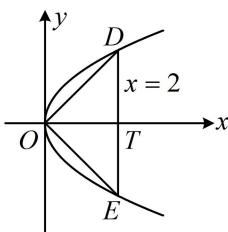

> [!faq]- 《第3节 抛物线小题的综合运算》例题解析
>
> > [!success]- **【答案】** B
>
> > [!note]- **【分析】**
> > 本题未单列分析。
>
> > [!note]- **【解析】**
> > A. $\left(\frac{1}{4},0\right)$ B. $\left(\frac{1}{2},0\right)$ C. (1,0) D. (2,0)
> >
> > 解法1：如图， $OD \perp OE$ 可用斜率翻译，求斜率需要 $D, E$ 坐标，联立直线 $x = 2$ 和抛物线可求得坐标，联立 $\left\{ \begin{array}{l} x = 2 \\ y^2 = 2px \end{array} \right.$ 解得： $y = \pm 2\sqrt{p}$ ，所以 $D(2, 2\sqrt{p})$ ， $E(2, -2\sqrt{p})$ ，
> >
> > 因为 $OD \perp OE$ ，所以 $k_{OD} \cdot k_{OE} = \frac{2\sqrt{p}}{2} \times \frac{-2\sqrt{p}}{2} = -1$ ，解得： $p = 1$ ，故 $C$ 的焦点为 $\left(\frac{1}{2}, 0\right)$ .
> >
> > 解法2：如图，观察发现由 $\triangle DOE$ 的几何特征可分析出点 $D$ 坐标，代入抛物线方程也能求 $p$
> >
> > 设直线 $x = 2$ 与 $x$ 轴交于点 $T$ ，则 $\vert OT\vert = 2$ ，由题意， $OD\bot OE$
> >
> > 结合对称性可得 $\triangle DOE$ 为等腰直角三角形， $\triangle DOT$ 也为等腰直角三角形，
> >
> > $$
> > \left| D T \right| = \left| O T \right| = 2
> > $$
> >
> > 代入 $y^{2} = 2px$ 得： $2^{2} = 2p \cdot 2$ ，解得： $p = 1$ ，故 $C$ 的焦点为 $\left(\frac{1}{2}, 0\right)$ .
> >
> > 
>
> > [!tip]- **【反思】**
> > 在简单的抛物线求值问题中，用直线的方程、点的坐标等直接翻译已知条件可以解决问题，但若能结合条件的几何特征分析，往往计算量更小.
