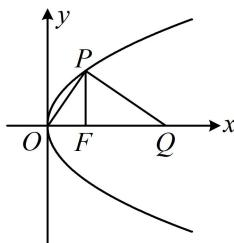

> [!faq]- 《第3节 抛物线小题的综合运算》例题解析
>
> > [!success]- **【答案】** $x = -\frac{3}{2}$
>
> > [!note]- **【分析】**
> > 本题未单列分析。
>
> > [!note]- **【解析】**
> > 解法1：如图，由 $PF\perp x$ 轴和 $|FQ|=6$ 可分别求出P，Q的坐标，再翻译 $PQ\perp OP$ 即可建立方程求p，
> > 由题意， $F\left(\frac{p}{2},0\right)$ ，将 $x=\frac{p}{2}$ 代入 $y^{2}=2px$ 解得： $y=\pm p$ ，不妨设 $P\left(\frac{p}{2},p\right)$ ， $|FQ|=6\Rightarrow Q\left(\frac{p}{2}+6,0\right)$ ，
> > 因为 $PQ\perp OP$ ，所以 $k_{OP}\cdot k_{PQ}=\frac{p}{\frac{p}{2}}\cdot\frac{p}{\frac{p}{2}-\left(\frac{p}{2}+6\right)}=-1$ ，解得：p=3，故C的准线方程为 $x=-\frac{3}{2}$ .
> >
> > 解法2: 如图, $|OF|$ , $|PF|$ 都好求, $|FQ|$ 又已知, 可抓住 $\angle POF = \angle FPQ$ 直接建立方程求 $p$ ,
> >
> > 由题意， $F\left(\frac{p}{2},0\right)$ ，将 $x=\frac{p}{2}$ 代入 $y^{2}=2px$ 解得： $y=\pm p$ ，所以 $|PF|=p$ ，因为 $PQ\perp OP$ ， $PF\perp OQ$ ，所以 $\angle POF+\angle OPF=\angle FPQ+\angle OPF=90^{\circ}$ ，故 $\angle POF=\angle FPQ$ ，所以 $\tan\angle POF=\tan\angle FPQ$ ，从而 $\frac{|PF|}{|OF|}=\frac{|FQ|}{|PF|}$ ，即 $\frac{p}{\frac{p}{2}}=\frac{6}{p}$ ，解得：p=3，故C的准线方程为 $x=-\frac{3}{2}$ .
> >
> > 
