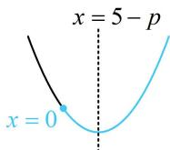
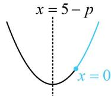

<!-- question-source:start -->
【变式】抛物线 $y^{2} = 2px (p > 0)$ 上任意一点 $P$ 到点 $M(5,0)$ 的距离的最小值为 4，则 $p =$ \_\_\_\_.

$$
P \left(\frac {y _ {0} ^ {2}}{2 p}, y _ {0}\right)
$$

$$
\left| P M \right|
$$

$$
P (x _ {0}, y _ {0})
$$

$$
\left| P M \right| = \sqrt {\left(x _ {0} - 5\right) ^ {2} + \left(y _ {0} - 0\right) ^ {2}} = \sqrt {x _ {0} ^ {2} - 1 0 x _ {0} + 2 5 + y _ {0} ^ {2}}
$$

有 $x_0$ 和 $y_0$ 两个变量，可利用抛物线方程来消元，因为点 $P$ 在抛物线上，所以 $y_0^2 = 2px_0$ ，代入式①可得 $\left|PM\right| = \sqrt{x_0^2 - 10x_0 + 25 + 2px_0} = \sqrt{x_0^2 - (10 - 2p)x_0 + 25}$ ， $x_0\geq 0$ 设 $f(x) = x^{2} - (10 - 2p)x + 25(x\geq 0)$ ，则 $\left|PM\right| = \sqrt{f(x)}$

$$
f (x)
$$

$$
x = 5 - p
$$

$$
[ 0, + \infty)
$$

当 $5 - p \geq 0$ 时， $0 < p \leq 5$ ，如图1， $f(x)_{\min} = f(5 - p) = (5 - p)^2 - (10 - 2p)(5 - p) + 25 = 25 - (5 - p)^2$ ，因为 $\left|PM\right|_{\min} = 4$ ，所以 $f(x)_{\min} = 16$ ，令 $25 - (5 - p)^2 = 16$ ，解得： $p = 2$ 或8（不满足 $0 < p \leq 5$ ，舍去）；

$$
5 - p <   0
$$

$$
p > 5
$$

$$
f (x) _ {\min} = f (0) = 2 5
$$

所以 $\left|PM\right|_{\min}=5$ ，不合题意；

综上所述， $p$ 的值为 2.

<!-- question-source:end -->

![[高中/总复习/教辅/一数常规版2026/第10章 解析几何/模块5 抛物线与方程/第3节 抛物线小题的综合运算/类型02_动点类问题/例题/answers/Q00049476A1.md]]
