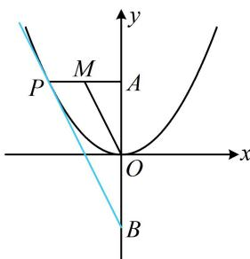

> [!faq]- 《第3节 抛物线小题的综合运算》例题解析
>
> > [!success]- **【答案】** D
>
> > [!note]- **【分析】**
> > 本题未单列分析。
>
> > [!note]- **【解析】**
> > A. $(2,+\infty)$ B. $[2,+\infty)$ C. $(-\infty,-2)$ D. $(-\infty,-2]$
> >
> > 解法1：点 $P$ 在抛物线上运动，可将其坐标设为单变量的形式，由题意，可设 $P\left(a, \frac{a^2}{4}\right)$ ，其中 $a < 0$ ，因为 $M$ 是 $PA$ 中点，所以 $M\left(\frac{a}{2}, \frac{a^2}{8} + 2\right)$ ，故 $k_{OM} = \frac{\frac{a^2}{8} + 2}{\frac{a}{2}} = \frac{a^2 + 16}{4a} = \frac{1}{4}\left(a + \frac{16}{a}\right)$ ，虽然 $a$ 和 $\frac{16}{a}$ 积为定值，但这两项均为负，不能直接用均值不等式，可先添负号，化负为正，所以 $k_{OM} = \frac{1}{4}\left(a + \frac{16}{a}\right) = -\frac{1}{4}\left[(-a) + \frac{16}{-a}\right] \leq -\frac{1}{4} \times 2\sqrt{(-a) \cdot \frac{16}{-a}} = -2$ ，当且仅当 $-a = \frac{16}{-a}$ ，即 $a = -4$ 时取等号，所以 $k_{OM}$ 的取值范围是 $(-∞, -2]$ .
> >
> > 解法2：涉及中点，想到中位线，题干只有 $M$ 一个中点，所以再构造一个中点出来，
> >
> > 如图，记 $B(0, -4)$ ，则 $O$ 为 $AB$ 的中点，
> >
> > 又 $M$ 为 $PA$ 的中点，所以 $OM \parallel PB$ ，故 $k_{OM} = k_{PB}$ ，于是只需求当 $P$ 运动时， $k_{PB}$ 的取值范围，如图所示的相切的情形即为 $k_{PB}$ 最大的情况，设图中切线 $PB$ 的方程为 $y = kx - 4$ ，代入 $x^{2} = 4y$ 整理得： $x^{2} - 4kx + 16 = 0$ ，判别式 $\Delta = (-4k)^{2} - 4 \times 1 \times 16 = 0$ ，解得： $k = \pm 2$ ，由图可知 $k = -2$ ，所以 $k_{PB} \in (-\infty, -2]$ ，故 $k_{OM} \in (-\infty, -2]$
> >
> > 
