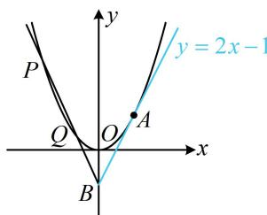

> [!faq]- 《第3节 抛物线小题的综合运算》例题解析
>
> > [!success]- **【答案】** BCD
>
> > [!note]- **【分析】**
> > 本题未单列分析。
>
> > [!note]- **【解析】**
> > A. C 的准线为 y = -1
> > B. 直线 AB 与 C 相切
> > C. $\left|OP\right|\cdot\left|OQ\right|>\left|OA\right|^{2}$ D. $\left|BP\right|\cdot\left|BQ\right|>\left|BA\right|^{2}$
> >
> > 解析：A项，点 $A(1,1)$ 在抛物线 $C$ 上 $\Rightarrow 1^2 = 2p\cdot 1\Rightarrow p = \frac{1}{2}\Rightarrow C$ 的准线为 $y = -\frac{1}{4}$ ，故A项错误；
> >
> > B项，如图，可用导数求出抛物线在点 $A$ 处的切线方程，再验证点 $B$ 是否在该切线上即可，
> >
> > $$
> > x ^ {2} = y \Rightarrow y ^ {\prime} = 2 x \Rightarrow y ^ {\prime} | _ {x = 1} = 2 \Rightarrow
> > $$
> >
> > $$
> > y - 1 = 2 (x - 1)
> > $$
> >
> > $$
> > y = 2 x - 1
> > $$
> >
> > $$
> > P (x _ {1}, x _ {1} ^ {2}), \quad Q (x _ {2}, x _ {2} ^ {2})
> > $$
> >
> > $$
> > \left| O P \right| \cdot \left| O Q \right| = \sqrt {x _ {1} ^ {2} + x _ {1} ^ {4}} \cdot \sqrt {x _ {2} ^ {2} + x _ {2} ^ {4}} = \sqrt {x _ {1} ^ {2} x _ {2} ^ {2} (1 + x _ {1} ^ {2}) (1 + x _ {2} ^ {2})} = \sqrt {x _ {1} ^ {2} x _ {2} ^ {2} (1 + x _ {1} ^ {2} + x _ {2} ^ {2} + x _ {1} ^ {2} x _ {2} ^ {2})}
> > $$
> >
> > 由题意，直线 $PQ$ 的斜率存在，可设其方程为 $y = kx - 1$ ，代入 $x^{2} = y$ 消去 $y$ 整理得： $x^{2} - kx + 1 = 0$ 判别式 $\Delta = k^2 -4 > 0\Rightarrow |k| > 2$ ，由韦达定理， $x_{1} + x_{2} = k$ ， $x_{1}x_{2} = 1$ 代入式①可得 $\left|OP\right|\cdot \left|OQ\right| = \sqrt{2 + x_1^2 + x_2^2} = \sqrt{2 + (x_1 + x_2)^2 - 2x_1x_2} = |k| > 2$
> >
> > 又 $\left|OA\right|^{2}=2$ ，所以 $\left|OP\right|\cdot\left|OQ\right|>\left|OA\right|^{2}$ ，故C项正确；
> >
> > D 项，已知点 B，用弦长公式 $\sqrt{1+k^{2}}\cdot|x_{1}-x_{2}|$ 算 $|BP|$ 和 $|BQ|$ 较方便，故同样用坐标运算来验证 D 项，
> > 由弦长公式， $\left|BP\right|=\sqrt{1+k^{2}}\cdot\left|0-x_{1}\right|=\sqrt{1+k^{2}}\cdot\left|x_{1}\right|$ ，同理， $\left|BQ\right|=\sqrt{1+k^{2}}\cdot\left|x_{2}\right|$ 所以 $\left|BP\right|\cdot\left|BQ\right|=\sqrt{1+k^{2}}\cdot\left|x_{1}\right|\cdot\sqrt{1+k^{2}}\cdot\left|x_{2}\right|=(1+k^{2})\left|x_{1}x_{2}\right|$ 将 C 项得到的 $|k| > 2$ 和 $x_{1}x_{2} = 1$ 代入上式可得 $\left|BP\right|\cdot\left|BQ\right| = 1 + k^{2} > 5$ 又 $\left|BA\right|^{2}=(0-1)^{2}+(-1-1)^{2}=5$ ，所以 $\left|BP\right|\cdot\left|BQ\right|>\left|BA\right|^{2}$ ，故 D 项正确.
> >
> >
> > 
>
> > [!tip]- **【反思】**
> > 同椭圆与双曲线一样，不方便用几何法求解问题时，我们常设点、设线进行坐标运算。若涉及 $x_{1} + x_{2}$ ， $x_{1}x_{2}$ ， $\left|x_{1} - x_{2}\right|$ ， $y_{1} + y_{2}$ ， $y_{1}y_{2}$ ， $\left|y_{1} - y_{2}\right|$ 这些量，常结合韦达定理求解，圆锥曲线中的这种计算思路与技巧，我们将在下个模块“模块6：解析几何大题”深入学习，所以本节只举一道例题。
