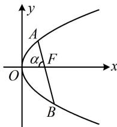

> [!faq]- 《第4节 高考中抛物线常用的二级结论》参考答案
>
> > [!success]- **【答案】** 详见解析
>
> > [!note]- **【分析】**
> > 本题未单列分析。
>
> > [!note]- **【解析】**
> > $\frac{5}{6}$
> >
> > 解法 1: 已知 $|AB|$ , 可由角版焦点弦公式求角, 再代入焦半径公式算 $|AF|$ ,
> >
> > 不妨设直线 $AB$ 为如图所示的情形，设 $\angle AFO = \alpha$ ，
> >
> > 其中 $0 < \alpha < \frac{\pi}{2}$ ，则 $\left|AB\right| = \frac{2}{\sin^2\alpha} = \frac{25}{12} \Rightarrow \sin \alpha = \frac{2\sqrt{6}}{5}$ ，
> >
> > $\cos \alpha = \sqrt{1 - \sin^2\alpha} = \frac{1}{5}$ 所以 $\left|AF\right| = \frac{1}{1 + \cos\alpha} = \frac{1}{1 + \frac{1}{5}} = \frac{5}{6}$ .
> >
> > 解法2： $|AB|$ 可转换成 $\vert AF\vert +\vert BF\vert$ ，把 $\vert AF\vert$ ， $\vert BF\vert$ 看成未知数，结合 $\frac{1}{\vert AF\vert} +\frac{1}{\vert BF\vert} = \frac{2}{p}$ 即可求解 $\vert AF\vert$
> >
> > 由题意， $p = 1$ ，所以 $\frac{1}{|AF|} +\frac{1}{|BF|} = \frac{2}{p} = 2$ ①，
> >
> > 又 $|AB| = |AF| + |BF| = \frac{25}{12}$ ②,
> >
> > 由①得 $\frac{|AF| + |BF|}{|AF|\cdot|BF|} = 2$ ，结合式②得 $|AF|\cdot|BF| = \frac{25}{24}$ ③，
> >
> > 由②③知 $\left|AF\right|$ ， $\left|BF\right|$ 是一元二次方程 $x^{2}-\frac{25}{12}x+\frac{25}{24}=0$
> >
> > 的两根，解得： $x = \frac{5}{6}$ 或 $\frac{5}{4}$ ，
> >
> > 因为 $\left|AF\right|<\left|BF\right|$ ，所以 $\left|AF\right|=\frac{5}{6}$ .
> >
> > 
