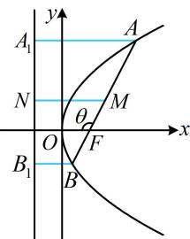

> [!faq]- 《第4节 高考中抛物线常用的二级结论》参考答案
>
> > [!success]- **【答案】** 详见解析
>
> > [!note]- **【分析】**
> > 本题未单列分析。
>
> > [!note]- **【解析】**
> > $\frac{5}{3}$
> >
> > 解法1：如图，由 $M$ 到 $y$ 轴的距离联想到 $M$ 到准线的距离，此距离可利用梯形的中位线与 $A$ ， $B$ 到准线的距离建立联系，由题意，抛物线 $C$ 的焦点到准线的距离 $p = 2$ ，准线方程为 $x = -1$
> >
> > 过 $A$ ， $M$ ， $B$ 分别作准线的垂线，垂足分别为 $A_{1}$ ， $N$ ， $B_{1}$ ，则点 $M$ 到 $y$ 轴的距离 $d = |MN| - 1 = \frac{|AA_1| + |BB_1|}{2} -1$ ①
> >
> > $$
> > \left| A A _ {1} \right| = \left| A F \right|, \quad \left| B B _ {1} \right| = \left| B F \right|
> > $$
> >
> > 代入①得 $d = \frac{|AF| + |BF|}{2} - 1$ ②，
> >
> > 条件给出 $\overrightarrow{AF} = 3\overrightarrow{FB}$ ，要由此求 $|AF|$ 和 $|BF|$ ，可将其转换成长度关系，用角版焦半径公式来翻译，
> >
> > 设 $\angle AFO = \theta$ ，则 $\angle BFO = \pi -\theta$ ，因为 $\overrightarrow{AF} = 3\overrightarrow{FB}$
> >
> > 所以 $\left|AF\right|=3\left|BF\right|$ ，故 $\frac{p}{1+\cos\theta}=3\cdot\frac{p}{1+\cos(\pi-\theta)}=\frac{3p}{1-\cos\theta}$
> >
> > 解得： $\cos \theta = -\frac{1}{2}$ ，所以 $\left|AF\right| = \frac{p}{1 + \cos\theta} = \frac{2}{1 - \frac{1}{2}} = 4$
> >
> > $\left|BF\right| = \frac{1}{3}\left|AF\right| = \frac{4}{3}$ ，代入②得 $d = \frac{5}{3}$
> >
> > 解法2：按解法1得到式②后，注意到 $\overrightarrow{AF} = 3\overrightarrow{FB}$ 可翻译为 $|AF| = 3|BF|$ ，故也可结合 $\frac{1}{|AF|} + \frac{1}{|BF|} = \frac{2}{p}$ 求 $|AF|$ 和 $|BF|$ ，由题意， $p = 2$ ，所以 $\frac{1}{|AF|} + \frac{1}{|BF|} = \frac{2}{p} = 1$ ③，
> >
> > 又 $\overrightarrow{AF} = 3\overrightarrow{FB}$ ，所以 $|AF| = 3|BF|$
> >
> > 结合式③可得 $\left|AF\right|=4,\quad\left|BF\right|=\frac{4}{3}$ ，代入②得 $d=\frac{5}{3}$ .
> >
> > 
