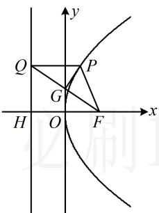

> [!faq]- 《第4节 高考中抛物线常用的二级结论》参考答案
>
> > [!success]- **【答案】** A
>
> > [!note]- **【分析】**
> > 本题未单列分析。
>
> > [!note]- **【解析】**
> > A
> >
> > 解法1：看到题干的过抛物线上的点 $P$ 向准线作垂线，马上想到抛物线定义，故连接 $PF$
> >
> > $$
> > \left| P Q \right| = \left| P F \right|
> > $$
> >
> > 所以 $\triangle PQF$ 是等腰三角形，且由题意， $\angle PQF = 30^{\circ}$ ，
> >
> > 观察发现只要求出 $|QF|$ ，就能求得 $|PQ|$ ，由于抛物线方程已知，所以 $|HF|$ 已知，故考虑在 $\triangle QHF$ 中算 $|QF|$ ，
> >
> > 由图可知， $PQ \parallel x$ 轴，所以 $\angle QFH = \angle PQF = 30^{\circ}$ ，
> >
> > 又由抛物线方程为 $y^{2} = 2x$ 可知 $p = 1$ ，所以 $|HF| = 1$ ，
> >
> > 故 $\left|QF\right|=\frac{\left|HF\right|}{\cos\angle QFH}=\frac{2\sqrt{3}}{3}$ ，取QF中点G，连接PG，
> >
> > 则 $PG \perp QF$ ， $\left|QG\right| = \frac{1}{2}\left|QF\right| = \frac{\sqrt{3}}{3}$
> >
> > 在 $\triangle PQG$ 中， $|PQ| = \frac{|QG|}{\cos\angle PQG} = \frac{\frac{\sqrt{3}}{3}}{\cos 30^\circ} = \frac{2}{3}$ .
> >
> > 
> >
> > 解法2：注意到 $|PQ| = |PF|$ ，故只需算 $|PF|$ ，结合图形我们发现 $\angle PFO$ 容易求得，故也可代角版焦半径公式求 $|PF|$ ，如图，由抛物线定义， $|PQ| = |PF|$ ，
> >
> > 又 $\angle PQF = 30^{\circ}$ ，所以 $\angle PFQ = 30^{\circ}$ ，因为 $PQ / / x$ 轴，
> >
> > 所以 $\angle QFH = \angle PQF = 30^{\circ}$ ，故 $\angle PFO = 60^{\circ}$
> >
> > 由角版焦半径公式， $\left|PF\right|=\frac{1}{1+\cos60^{\circ}}=\frac{2}{3}$ ，所以 $\left|PQ\right|=\frac{2}{3}$ .
